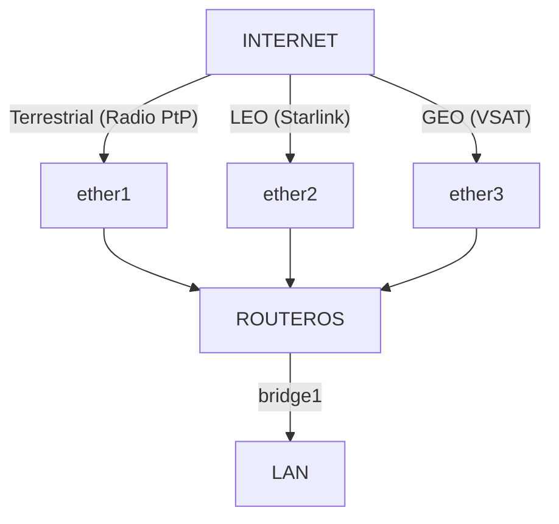

# Failover & Multi-WAN Satelit

Di area operasional remote (seperti site pertambangan, perkebunan, atau kapal laut), bergantung pada satu jalur koneksi sangat berisiko. Arsitektur jaringan modern di lokasi tersebut umumnya menggunakan skema **Hybrid WAN** yang memadukan beberapa jenis koneksi sekaligus:

1.  **Jalur Utama (Terrestrial):** Link Fiber Optik atau Radio Wireless Point-to-Point (jika terjangkau). Latensi rendah, bandwidth stabil.
2.  **Jalur Cadangan 1 (LEO Satelit - Starlink):** Latensi rendah (≈30 ms), bandwidth besar, tetapi tidak memiliki jaminan SLA penuh.
3.  **Jalur Cadangan 2 / Bulk Data (GEO Satelit - VSAT):** Latensi tinggi (≈600 ms), bandwidth sempit, tetapi sangat andal terhadap cuaca jika menggunakan C-band dan memiliki jaminan SLA (CIR).

Materi praktik ini membahas konfigurasi **Recursive Routing** untuk failover otomatis yang cerdas dan **Policy-Based Routing (PBR)** di RouterOS v7.

---

## Topologi Jaringan


*Tiga jalur WAN (terrestrial, LEO Starlink, GEO VSAT) masuk lewat ether1/2/3 ke satu RouterOS, diteruskan ke LAN lewat bridge1.*

---

## 1. Failover Cerdas: Recursive Routing (RouterOS v7)

Failover biasa menggunakan `check-gateway=ping` hanya memeriksa apakah interface fisik ke modem hidup atau mati. Jika modem satelit/starlink tetap menyala tetapi koneksi satelitnya terputus ke internet, router tidak akan mengetahuinya.

**Recursive Routing** memecahkan masalah ini dengan memaksa router melakukan ping ke IP publik di internet (misalnya DNS Google `8.8.8.8` dan DNS Cloudflare `1.1.1.1`) melalui gerbang modem masing-masing.

### Konfigurasi Rute Rekursif

Kita asumsikan IP Gateway modem Terrestrial adalah `192.0.2.1` dan Starlink adalah `198.51.100.1`.

```routeros
# 1. Buat rute virtual khusus ke DNS Publik lewat gateway fisik masing-masing
/ip route
add dst-address=8.8.8.8/32 gateway=192.0.2.1 scope=10 comment="Jalur cek Terrestrial"
add dst-address=1.1.1.1/32 gateway=198.51.100.1 scope=10 comment="Jalur cek Starlink"

# 2. Buat rute default rekursif yang merujuk pada IP DNS Publik tersebut
add dst-address=0.0.0.0/0 gateway=8.8.8.8 check-gateway=ping distance=1 target-scope=30 comment="Default Route Utama (Terrestrial)"
add dst-address=0.0.0.0/0 gateway=1.1.1.1 check-gateway=ping distance=2 target-scope=30 comment="Default Route Cadangan (Starlink)"
```

### Cara Kerjanya:
*   Router akan mengirim ping ke `8.8.8.8` secara berkala melalui gateway `192.0.2.1` (Terrestrial).
*   Selama ping ke `8.8.8.8` berhasil, Rute Default Utama (`distance=1`) tetap aktif.
*   Jika jalur Terrestrial mati di tengah jalan (ping ke `8.8.8.8` gagal), rute utama dinonaktifkan, dan lalu lintas otomatis berpindah ke rute cadangan Starlink (`distance=2` yang memantau ping ke `1.1.1.1`).
*   `target-scope=30` memaksa router mencari rute gateway rekursif dengan nilai `scope` yang lebih kecil atau sama dengan 30.

---

## 2. Policy-Based Routing (PBR) di RouterOS v7

Terkadang kita tidak ingin koneksi satelit GEO (VSAT) menganggur hanya sebagai cadangan pasif. Kita ingin membagi lalu lintas secara cerdas:
*   **Trafik Kritis & Real-time** (VoIP, Database Transaksi, SSH) diarahkan lewat link Terrestrial atau Starlink karena latensinya rendah.
*   **Trafik Bulk & Umum** (Download File, Browsing Umum, Update OS) diarahkan lewat link VSAT GEO yang bandwidth-nya terpisah agar tidak mengganggu link utama.

### Langkah 1: Daftarkan Tabel Routing Baru
Di RouterOS v7, setiap tabel routing kustom harus didaftarkan terlebih dahulu:

```routeros
/routing table
add name=to-fast-link fib
add name=to-vsat-link fib
```

### Langkah 2: Buat Rute Default untuk Masing-Masing Tabel
Tentukan jalur keluar default untuk masing-masing tabel routing yang baru dibuat:

```routeros
/ip route
# Rute untuk trafik cepat (Terrestrial/Starlink)
add dst-address=0.0.0.0/0 gateway=8.8.8.8 routing-table=to-fast-link target-scope=30
# Rute untuk trafik VSAT (GEO)
add dst-address=0.0.0.0/0 gateway=203.0.113.1 routing-table=to-vsat-link comment="Gateway VSAT"
```

### Langkah 3: Tandai Paket Menggunakan Mangle
Gunakan firewall mangle untuk menandai paket data berdasarkan jenis layanannya:

```routeros
/ip firewall mangle
# 1. Tandai koneksi VoIP (SIP/RTP) dan SSH untuk masuk ke jalur cepat
add chain=prerouting src-address=192.168.88.0/24 protocol=udp dst-port=5060,10000-20000 action=mark-connection new-connection-mark=fast-conn passthrough=yes comment="Mark VoIP"
add chain=prerouting src-address=192.168.88.0/24 protocol=tcp dst-port=22 action=mark-connection new-connection-mark=fast-conn passthrough=yes comment="Mark SSH"

# 2. Arahkan koneksi bertanda fast-conn ke tabel routing to-fast-link
add chain=prerouting src-address=192.168.88.0/24 connection-mark=fast-conn action=mark-routing new-routing-mark=to-fast-link passthrough=no

# 3. Tandai sisa trafik lainnya (seperti browsing umum) untuk masuk ke jalur VSAT
add chain=prerouting src-address=192.168.88.0/24 action=mark-routing new-routing-mark=to-vsat-link passthrough=no comment="Sisa trafik ke VSAT"
```

::: warning Perhatikan Aturan FastTrack
Jika kamu menggunakan **FastTrack** pada firewall rule IPv4, paket yang di-FastTrack akan melompati rantai Mangle. Untuk memastikan Policy-Based Routing bekerja dengan benar, pastikan untuk mengecualikan paket yang ditandai dari FastTrack.
:::

---

## Cek pemahaman

1.  Mengapa `check-gateway=ping` pada rute statis biasa dianggap kurang andal untuk link satelit atau modem internet modern?
    <br>→ Karena hanya menguji konektivitas lokal antara port router dan modem. Jika modem tetap menyala tetapi jaringan satelit/internet di atasnya putus, router akan tetap menganggap jalur tersebut aktif dan tidak akan memindahkan trafik.
2.  Apa fungsi dari parameter `scope` dan `target-scope` dalam konfigurasi *Recursive Routing*?
    <br>→ Parameter `scope` menetapkan tingkat prioritas atau cakupan identifikasi suatu rute, sedangkan `target-scope` digunakan oleh rute rekursif untuk mencari gateway tidak langsung (IP publik di internet) dengan mencocokkan rute lain yang memiliki nilai `scope` di bawah atau sama dengan target-scope tersebut.
3.  Mengapa trafik VoIP direkomendasikan untuk diarahkan lewat link Terrestrial atau Starlink dibanding VSAT GEO pada konfigurasi PBR?
    <br>→ Karena VoIP sangat sensitif terhadap latensi. Latensi VSAT GEO yang tinggi (≈600 ms) akan menyebabkan jeda suara yang sangat terasa mengganggu percakapan dua arah, sedangkan Starlink/Terrestrial memiliki latensi jauh lebih rendah (<50 ms).
