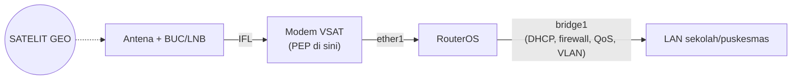

# Wireless & Satelit

Bab penutup modul praktik ini mengudara dua kali: pertama lewat Wi-Fi
(sentimeter sampai kilometer), lalu lewat [transponder di orbit](/satelit/)
(36.000 km). Keduanya [layer 1–2 nirkabel](/networking/model-osi#layer-1-—-physical)
dengan aturan main yang sudah kamu pelajari — tinggal dieksekusi.

## Wi-Fi di RouterOS: paket `wifi`

RouterOS v7 memakai paket driver baru bernama `wifi` (menu
`/interface/wifi`) untuk chipset 802.11ac/ax modern — menggantikan menu
`wireless` lama. Konsepnya tetap: satu radio, mode menentukan perannya.

### Mode AP: memancarkan jaringan

Sintaks resmi konfigurasi dasar AP:

```routeros
/interface/wifi/set wifi1 disabled=no configuration.country=Indonesia \
  configuration.ssid=NetSat-Kantor security.authentication-types=wpa2-psk,wpa3-psk \
  security.passphrase=SandiWiFi_Kantor1
```

- `configuration.country=Indonesia` — bukan formalitas: menentukan kanal dan
  batas daya yang legal sesuai regulasi
  [spektrum](/satelit/frekuensi-band#siapa-yang-mengatur-spektrum) nasional.
- `security.authentication-types=wpa2-psk,wpa3-psk` — mode transisi: klien
  baru memakai WPA3, yang lama tetap tersambung via WPA2 — praktik
  [enkripsi di mana-mana](/networking/keamanan#kebersihan-dasar-baseline).
- Interface `wifi1` lalu dimasukkan [bridge LAN](/mikrotik/bridging-switching#bridge-switch-virtual-di-dalam-router)
  agar klien nirkabel dan kabel se-jaringan — atau diberi VLAN sendiri untuk
  jaringan tamu.

### Mode station: menjadi klien

Untuk menautkan gedung seberang (point-to-point) atau menumpang Wi-Fi lain,
radio menjadi *station*:

```routeros
/interface/wifi/set wifi1 configuration.mode=station configuration.ssid=NetSat-Kantor \
  security.passphrase=SandiWiFi_Kantor1
```

- `configuration.mode=station` — radio berhenti memancarkan beacon dan
  bergabung ke AP ber-SSID tersebut, persis laptop — tapi dengan antena dan
  penempatan kelas luar-ruang.

### CAPsMAN sekilas

Mengelola 30 AP satu per satu tidak masuk akal. **CAPsMAN** menjadikan satu
router pengendali (*controller*) bagi semua AP (*CAP*): konfigurasi SSID,
keamanan, dan kanal ditulis sekali di controller, disebarkan otomatis.

```routeros
/interface/wifi/capsman/set enabled=yes
/interface/wifi/provisioning/add action=create-dynamic-enabled \
  master-configuration=konfig-kantor
```

- `provisioning` — aturan "AP baru yang mendaftar, beri konfigurasi ini" —
  AP tinggal colok, controller yang berpikir. Arsitekturnya senada
  [pengelolaan terpusat](/networking/keamanan#segmentasi-dan-zero-trust)
  di mana pun: satu sumber kebijakan, banyak pelaksana.

## RouterOS di jaringan VSAT

Di puluhan ribu titik [VSAT](/satelit/vsat) Indonesia, kotak setelah modem
satelit sering kali RouterOS. Topologinya:


*Rantai perangkat khas titik VSAT sekolah/puskesmas: satelit → antena → modem
(PEP) → RouterOS → LAN lokal.*

Semua bab sebelumnya berlaku apa adanya — plus penyesuaian khusus link
[ber-RTT ±600 ms](/satelit/komunikasi#latensi-per-orbit):

**1. Jangan lawan PEP-nya.** [Akselerasi TCP](/satelit/komunikasi#dampak-latensi-pada-tcp)
hidup di modem; ia butuh melihat header TCP. Trafik boleh saja kamu
[VPN-kan](/mikrotik/vpn#vpn-di-atas-link-satelit) — tapi sadari harganya, dan
pilih WireGuard/UDP bila memang harus.

**2. QoS adalah keharusan, bukan hiasan.** Kapasitas
[CIR](/satelit/vsat#merancang-layanan-parameter-yang-diperjualbelikan) yang
dijamin mungkin hanya 2 Mbps — tanpa antrean prioritas, satu unduhan Windows
Update membunuh telepon VoIP puskesmas:

```routeros
/queue/tree/add name=uplink parent=global max-limit=2M
/queue/tree/add name=voip-sat parent=uplink packet-mark=voip priority=1 limit-at=512k max-limit=1M
/queue/tree/add name=data-sat parent=uplink packet-mark=no-mark priority=8 max-limit=2M
```

- `max-limit=2M` di induk **sedikit di bawah kapasitas nyata** link — antrean
  harus terjadi di router (yang kamu kendalikan), bukan di
  [buffer modem](/satelit/vsat#pep-dan-akselerasi-tcp) (yang tidak).
  Tanda `voip` berasal dari [mangle](/mikrotik/firewall-qos#mangle-dan-fasttrack) —
  dan ingat: [FastTrack harus dikecualikan](/mikrotik/firewall-qos#mangle-dan-fasttrack)
  agar penandaan bekerja.

**3. Layani sebanyak mungkin secara lokal.** Setiap RTT yang dihemat terasa:

```routeros
/ip/dns/set allow-remote-requests=yes cache-size=4096KiB
/system/ntp/server/set enabled=yes
/system/ntp/client/set enabled=yes servers=203.0.113.123
```

- [Cache DNS](/mikrotik/dhcp-dns-nat#dns-router-sebagai-cache) lokal memangkas
  ±600 ms dari **setiap** resolusi nama yang berulang; router juga menjadi
  server [NTP](/networking/protokol#protokol-pendukung-yang-jarang-disadari)
  bagi LAN — satu sinkronisasi ke atas, semua jam lokal akur.

**4. Awasi link-nya dari jauh.** Situs VSAT jarang punya teknisi:

```routeros
/tool/netwatch/add host=172.16.0.1 interval=30s down-script="/log warning \"link satelit down\""
/interface/monitor-traffic ether1 once
```

- `netwatch` memantau keterjangkauan gateway hub dan menjalankan skrip saat
  putus (log, kirim notifikasi, aktifkan jalur cadangan —
  [failover distance](/mikrotik/routing#failover-dua-wan-distance-check-gateway)
  melengkapinya).

::: tip Timer protokol vs latensi orbit
Menjalankan [OSPF](/mikrotik/routing#ospf) melintasi link GEO? Ingat
[peringatan modul teori](/networking/routing#routing-dan-satelit): timer hello
yang agresif bisa salah memvonis link mati hanya karena RTT-nya setengah
detik. Longgarkan timer, atau cukup gunakan rute statis + `check-gateway` —
sederhana sering kali lebih tangguh.
:::

## Cek pemahaman

1. Kenapa `configuration.country` wajib benar?
2. QoS satelitmu tak berpengaruh padahal queue tree rapi — dua tersangka?
3. Apa untungnya router remote menjadi DNS cache + NTP server lokal?

<details>
<summary>Lihat jawaban</summary>

1. Kanal dan daya pancar diatur regulasi nasional — salah negara = ilegal
   sekaligus mengganggu pengguna [spektrum](/satelit/frekuensi-band) lain.
2. FastTrack (paket melompati queue) atau `max-limit` induk ≥ kapasitas link
   (antrean pindah ke modem).
3. Memotong RTT ±600 ms dari transaksi kecil berulang — persentase
   penghematan terbesar justru di paket-paket terkecil.

</details>

## Modul praktik selesai

Tiga modul kini saling mengunci: [teori jaringan](/networking/) menjelaskan
*kenapa*, [modul satelit](/satelit/) menjelaskan *lewat mana*, dan modul ini
menunjukkan *bagaimana mengetiknya*. Bawa ketiganya ke lab
([CHR gratis](/mikrotik/#routeros-dan-routerboard) menunggu), rusak sesuatu,
perbaiki, ulangi — di situlah ilmunya menempel. Kontribusi dan koreksi tetap
terbuka di [GitHub](https://github.com/aderamdani/netsat).
