# Firewall — Panduan Lengkap

Firewall adalah pintu gerbang antara jaringan yang kamu percaya (LAN) dan
yang tidak kamu percaya (internet). Ia menerapkan kebijakan: paket mana
boleh lewat, mana yang ditolak, mana yang dicatat.

Halaman ini membahas firewall dari fondasi hingga praktik operasional —
tanpa terikat vendor tertentu. Contoh CLI diambil dari RouterOS, iptables,
dan Linux, tapi konsepnya berlaku di mana saja.

## Generasi firewall

Firewall berevolusi seiring ancaman yang semakin canggih:

| Generasi | Disebut juga | Cara kerja | Era | Contoh |
|----------|-------------|------------|-----|--------|
| **1** | *Packet filter* | Periksa header IP/TCP/UDP saja | 1990-an | iptables `stateless`, Cisco ACL |
| **2** | *Stateful firewall* | Pantau koneksi, izinkan return traffic otomatis | 1994+ | iptables `conntrack`, RouterOS firewall, pfSense |
| **3** | *Application / Proxy* | Proxy di L7 — aplikasi "ngomong" ke proxy, proxy ke server | 2000-an | Squid, Blue Coat |
| **4** | *NGFW* (Next-Gen FW) | IPS + SSL inspection + app ID + identity awareness | 2010+ | FortiGate, Palo Alto, Check Point |
| **5** | *Cloud / Threat NGFW* | + threat intel cloud + ML + API-aware | 2020+ | Cloudflare WAF, AWS WAF, FortiGate + FortiCloud |

### Generasi 1: Packet filter (stateless)

Melihat satu paket secara terpisah, tanpa ingatan. Keputusan berdasarkan:

- IP sumber / tujuan
- Port sumber / tujuan
- Protokol (TCP, UDP, ICMP)
- Flag TCP (SYN, ACK, FIN...)

**Kelemahan**: harus membuat aturan *return traffic* secara manual. Lihat
celahnya:

```bash
# iptables: stateless rule — izinkan SSH ke server
iptables -A FORWARD -p tcp --dport 22 -s 0/0 -d 203.0.113.10 -j ACCEPT

# Return traffic juga harus diizinkan manual:
iptables -A FORWARD -p tcp --sport 22 -s 203.0.113.10 -d 0/0 -j ACCEPT
# Tapi ini mengizinkan server memulai koneksi SSH keluar dari port 22 ke mana pun!
```

Kesulitan: menentukan port sumber return traffic (acak, di atas 32768).
Solusi kasar: buka semua port tinggi. Tepat itulah mengapa *stateful*
diciptakan.

### Generasi 2: Stateful firewall

Firewall modern (termasuk RouterOS, iptables dengan `conntrack`, pfSense)
bersifat **stateful**:

- Pertama kali paket masuk → dicatat di **tabel koneksi** (*connection
  tracking / conntrack*).
- Semua paket berikutnya dari koneksi yang sama → diizinkan otomatis, tanpa
  aturan eksplisit untuk return traffic.
- Koneksi punya *state*: `NEW`, `ESTABLISHED`, `RELATED`, `INVALID`.

```bash
# RouterOS — aturan stateful minimal:
/ip/firewall/filter/add chain=input connection-state=established,related action=accept
/ip/firewall/filter/add chain=input connection-state=invalid action=drop
/ip/firewall/filter/add chain=input action=drop  # default deny
```

### Generasi 3: Application / Proxy firewall

Firewall proxy menjadi perantara (intermediari) antara klien dan server:

- Klien terhubung ke proxy.
- Proxy memeriksa konten (URL, header HTTP, isi body).
- Lalu proxy membuat koneksi baru ke server tujuan atas nama klien.

Keunggulan: bisa menyembunyikan jaringan internal, memblokir konten spesifik
(kata kunci, kategori situs), dan melakukan *caching*.

Kelemahan: tidak cocok untuk lalu lintas real-time (VoIP, video streaming),
overhead CPU tinggi, dan beberapa aplikasi tidak mendukung proxy.

### Generasi 4: NGFW (Next-Generation Firewall)

NGFW menggabungkan semua fungsi sebelumnya ditambah:

- **Intrusion Prevention System (IPS)** — deteksi dan cegah exploit.
- **SSL/TLS inspection** — buka HTTPS untuk diperiksa (dengan *certificate
  pinning* atau *bumping*).
- **Application identification** — kenali aplikasi (bukan hanya port):
  "Facebook" bukan "port 443".
- **User/identity awareness** — kebijakan berdasarkan siapa penggunanya,
  bukan hanya IP (integrasi AD, LDAP, RADIUS).
- **Content filtering** — blokir berdasarkan URL, kategori, file type.
- **Threat intelligence** — IP/domain/URL jahat langsung diblokir otomatis.

### Generasi 5: Cloud-native / Threat-focused

Perkembangan terbaru: firewall sebagai layanan (FWaaS) dan ancara berbasis
cloud:

- **FWaaS** — firewall di cloud (Zscaler, Cloudflare, Netskope). Trafik
  diarahkan ke cloud untuk diperiksa.
- **Cloud WAF** — melindungi aplikasi web dari serangan L7 (SQL injection,
  XSS, DDoS L7).
- **API-aware** — memahami protokol API modern (REST, GraphQL).
- **ML-based** — deteksi anomali dengan machine learning.

## Cara kerja stateful firewall

### Alur packet (packet flow)

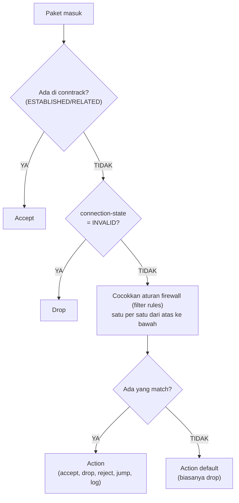

### Connection tracking (conntrack)

Firewall stateful menyimpan tabel koneksi. Di RouterOS:

```bash
/ip/firewall/connection/print count
```

Di Linux:

```bash
cat /proc/net/nf_conntrack
conntrack -L
```

Setiap entri mencatat:

| Field | Contoh | Keterangan |
|-------|--------|------------|
| Protocol | TCP/UDP/ICMP | |
| Source IP | 192.168.1.10 | |
| Source port | 54321 | |
| Dest IP | 203.0.113.5 | |
| Dest port | 80 | |
| State | ESTABLISHED | Status koneksi |
| Timeout | 300 | Detik sebelum dihapus |
| Bytes | 1.2M | Jumlah data lewat |

**Timeout conntrack penting**: terlalu pendek dan koneksi lambat terputus
sebelum selesai; terlalu panjang dan tabel penuh (`conntrack table full`)
yang menyebabkan koneksi baru ditolak.

```bash
# RouterOS — lihat dan atur timeout conntrack
/ip/firewall/connection/tracking/print
/ip/firewall/connection/tracking/set tcp-established-timeout=1d
```

## Komponen firewall

### 1. Aturan (rules)

Aturan firewall dievaluasi dari atas ke bawah. Begitu ada kecocokan,
*action* dijalankan dan evaluasi berhenti (kecuali `jump` ke chain lain).

Setiap aturan minimal terdiri dari:

- **Chain** — titik dalam alur paket (lihat di bawah).
- **Match** — kondisi yang harus dipenuhi.
- **Action** — apa yang dilakukan jika cocok.

```bash
# Anatomi aturan RouterOS:
/ip/firewall/filter/add \
  chain=input \
  src-address=203.0.113.0/24 \
  dst-port=22 \
  protocol=tcp \
  in-interface=ether1 \
  connection-state=new \
  log=yes \
  action=accept
```

Di iptables, konsep yang sama:

```bash
iptables -A INPUT -s 203.0.113.0/24 -p tcp --dport 22 -i eth0 -m state --state NEW -j ACCEPT
```

### Chain utama

| Chain | RouterOS | iptables/nftables | Fungsi |
|-------|----------|-------------------|--------|
| INPUT | `chain=input` | `INPUT` | Paket yang **tujuannya ke firewall itu sendiri** (trafik mgmt) |
| OUTPUT | `chain=output` | `OUTPUT` | Paket yang **berasal dari firewall** |
| FORWARD | `chain=forward` | `FORWARD` | Paket yang **diteruskan** lewat firewall (routing) |
| PREROUTING | (NAT chain) | `PREROUTING` | **Sebelum** keputusan routing — untuk DNAT |
| POSTROUTING | (NAT chain) | `POSTROUTING` | **Sesudah** keputusan routing — untuk SNAT/MASQUERADE |

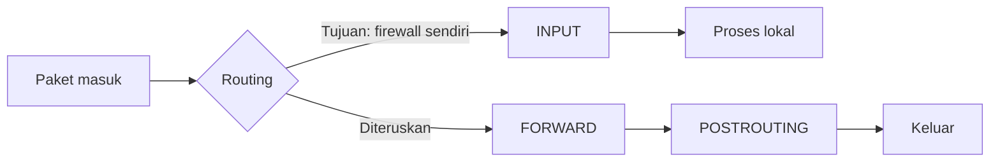
*Paket yang ditujukan ke firewall sendiri masuk ke chain INPUT, sedangkan paket yang diteruskan melewati FORWARD lalu POSTROUTING sebelum keluar.*

### 2. Interface & zone

Firewall menerapkan aturan berdasarkan **interface** atau **zone**
(kumpulan interface).

**Interface-based** (RouterOS, iptables):

```bash
# RouterOS — aturan berlaku hanya untuk interface tertentu
/ip/firewall/filter/add chain=input in-interface=wan1 action=accept protocol=icmp
/ip/firewall/filter/add chain=input in-interface=lan1 action=accept connection-state=established,related
```

**Zone-based** (FortiGate, Palo Alto, VyOS):

```bash
# VyOS — tentukan zona, lalu aturan antar zona
set zone-policy zone LAN interface eth1
set zone-policy zone WAN interface eth0
set zone-policy rule 10 source zone LAN
set zone-policy rule 10 destination zone WAN
set zone-policy rule 10 action accept
```

Konsep zona membantu kebijakan yang lebih terstruktur:
- **trust → untrust**: izinkan semua keluar (dengan conntrack).
- **untrust → trust**: tolak semua, kecuali yang diizinkan eksplisit.
- **trust → DMZ**: izinkan tertentu (misal HTTP/HTTPS ke web server).
- **DMZ → trust**: tolak semua (server yang dibobol jangan bisa menjalar).

### 3. Connection tracking states

| State | Arti | Contoh |
|-------|------|--------|
| **NEW** | Paket pertama koneksi baru | SYN TCP pertama |
| **ESTABLISHED** | Koneksi sudah terbentuk | Paket ACK dalam koneksi TCP |
| **RELATED** | Koneksi baru yang terkait koneksi yang sudah ada | FTP data channel, ICMP error |
| **INVALID** | Paket tidak bisa diidentifikasi | Paket rusak, SYN tanpa ACK saat sudah ESTABLISHED |

```bash
# Aturan minimal untuk setiap edge firewall:
/ip/firewall/filter/add chain=input connection-state=established,related action=accept
/ip/firewall/filter/add chain=input connection-state=invalid action=drop
/ip/firewall/filter/add chain=forward connection-state=established,related action=accept
/ip/firewall/filter/add chain=forward connection-state=invalid action=drop
```

### 4. NAT (Network Address Translation)

NAT bukan fungsi keamanan murni — ia adalah solusi keterbatasan IPv4.
Tapi ia selalu hidup berdampingan dengan firewall.

**Source NAT (SNAT / MASQUERADE)** — mengubah IP sumber:

```bash
# RouterOS — masquerade (otomatis pakai IP interface keluar)
/ip/firewall/nat/add chain=srcnat out-interface=wan1 action=masquerade

# SNAT eksplisit (ganti IP sumber dengan IP tertentu)
/ip/firewall/nat/add chain=srcnat out-interface=wan1 src-address=192.168.1.0/24 \
  action=snat to-addresses=203.0.113.1
```

**Destination NAT (DNAT / port forwarding)** — mengubah IP tujuan:

```bash
# RouterOS — akses HTTP server internal dari internet
/ip/firewall/nat/add chain=dstnat in-interface=wan1 protocol=tcp dst-port=80 \
  action=dst-nat to-addresses=192.168.1.10 to-ports=80
```

**NAT reflection / hairpin NAT** — akses server dari dalam LAN menggunakan
IP publik:

```bash
# RouterOS — tanpa reflection, akses dari LAN ke WAN IP sendiri gagal
# Solusi: tambah aturan dst-nat untuk trafik dari interface LAN
/ip/firewall/nat/add chain=dstnat in-interface=lan1 protocol=tcp dst-port=80 \
  dst-address=203.0.113.1 action=dst-nat to-addresses=192.168.1.10
```

> Dalam praktik, solusi yang lebih bersih adalah menggunakan **split-DNS**
> (DNS internal mengembalikan IP LAN untuk nama domain yang sama) sehingga
> NAT reflection tidak diperlukan.

## Arsitektur firewall

### 1. Screening router

Router di edge jaringan yang melakukan packet filtering dasar:

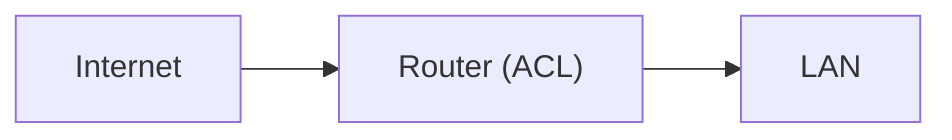
*Screening router: satu perangkat di edge melakukan packet filtering dasar antara internet dan LAN.*

**Cocok untuk**: kantor kecil, koneksi tunggal, tim IT minimal.
**Kelemahan**: tanpa stateful inspection, fitur terbatas.

### 2. Bastion host

Host yang sengaja diekspos ke internet — satu-satunya titik masuk ke
jaringan internal:

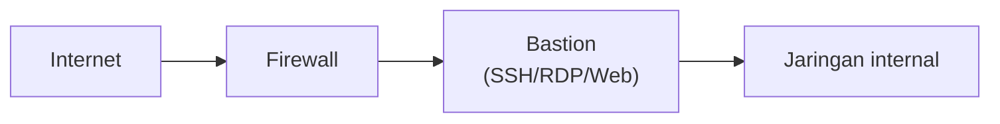
*Bastion host adalah satu-satunya titik masuk ke jaringan internal — semua akses (SSH/RDP/Web) wajib melewatinya, tidak ada jalur pintas langsung.*

Bastion menyediakan:
- **Jump box** untuk SSH/RDP ke server internal.
- **Logging** semua sesi akses.
- **MFA** di titik masuk (tidak perlu MFA di setiap server).
- **Session recording** untuk audit.

Di RouterOS, bastion tidak umum. Tapi konsepnya bisa diterapkan dengan
management access list dan IP firewall:

```bash
/ip/firewall/filter/add chain=input protocol=tcp dst-port=22 \
  src-address-list=mgmt-bastion action=accept
/ip/firewall/filter/add chain=input protocol=tcp dst-port=22 action=drop
```

### 3. DMZ (Demilitarized Zone)

Segmen terpisah antara internet dan jaringan internal. Server publik
(misal web, email, DNS) ditaruh di DMZ — jika dibobol, penyerang tidak
langsung masuk ke LAN internal:

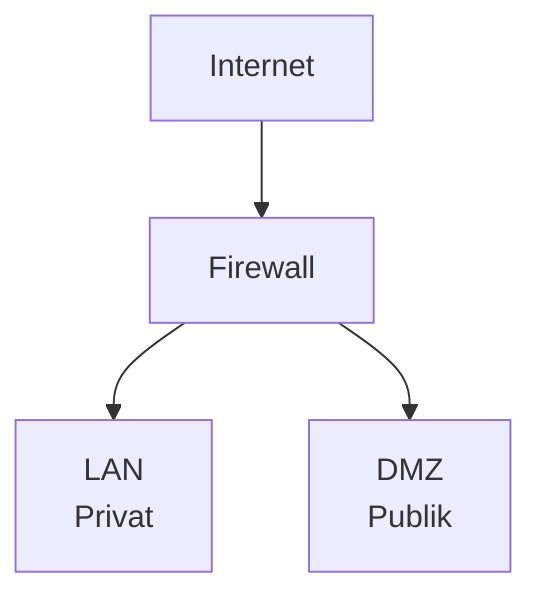
*Firewall memisahkan internet dari dua segmen: LAN privat (internal) dan DMZ publik (server yang diekspos) — jika DMZ dibobol, penyerang tidak langsung masuk ke LAN.*

**Aturan firewall untuk DMZ**:

| Arah | Aturan |
|------|--------|
| WAN → DMZ | Izinkan port yang diperlukan (80/443, 25, 53) |
| LAN → DMZ | Izinkan hanya yang perlu (admin akses web server via port 22) |
| DMZ → LAN | **Ditolak** — server publik tidak boleh inisiasi koneksi ke internal |
| DMZ → WAN | Boleh (update OS, apt/yum) — hanya ke IP tertentu jika bisa |
| LAN → WAN | Boleh (dengan stateful conntrack) |

```bash
# RouterOS — implementasi DMZ
/ip/firewall/filter/add chain=forward in-interface=wan out-interface=dmz \
  connection-state=new protocol=tcp dst-port=80,443 action=accept
/ip/firewall/filter/add chain=forward in-interface=dmz out-interface=lan \
  action=drop  # DMZ tidak boleh mulai koneksi ke LAN
```

### 4. Transparent / Bridge mode

Firewall tidak bertindak sebagai router. Ia "diselipkan" di antara switch
dan router, bekerja di L2 seperti bridge yang memeriksa paket:

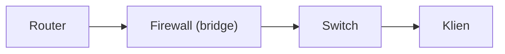
*Mode transparent/bridge: firewall bekerja di L2 tanpa IP, "diselipkan" di antara router dan switch tanpa mengubah skema pengalamatan.*

**Cocok untuk**: organisasi yang tidak ingin mengubah skema IP. Firewall
dioper tanpa IP pada interface bridge-nya.

RouterOS bisa menjadi bridge firewall:

```bash
/interface/bridge/add name=bridge-firewall
/interface/bridge/port/add bridge=bridge-firewall interface=ether1
/interface/bridge/port/add bridge=bridge-firewall interface=ether2
/ip/firewall/filter/add chain=forward in-bridge=bridge-firewall ...
```

### 5. High Availability (HA) — A/P dan A/A

Firewall adalah *single point of failure*. Solusinya: pasangan HA.

**Active / Passive (A/P)**:
- Satu aktif memproses trafik, satu siaga (standby).
- Jika aktif mati, yang pasif mengambil alih.
- IP dan sesi dialihkan (state sync).
- RouterOS: `/interface/vrrp/`.

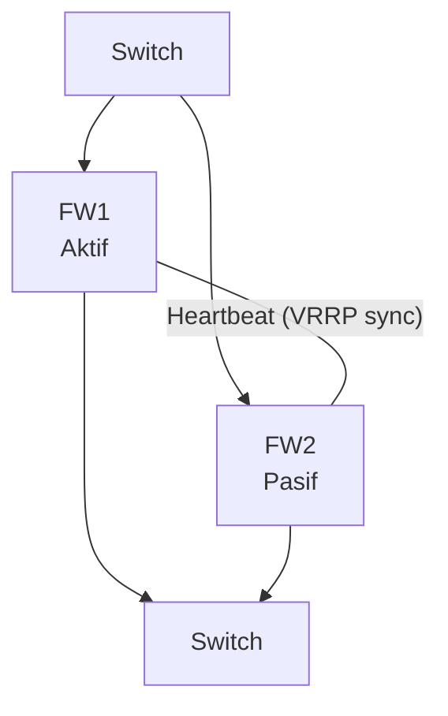
*Pasangan HA Active/Passive: kedua firewall terhubung ke switch di kedua sisi dan saling bertukar heartbeat (VRRP) — jika FW1 (aktif) mati, FW2 (pasif) mengambil alih.*

**Active / Active (A/A)**:
- Kedua firewall aktif, membagi beban trafik.
- Lebih rumit: perlu *state sync* dua arah.
- Beban konfigurasi lebih tinggi. Di sebagian besar kasus, A/P sudah cukup.

### 6. Multi-tier (web, app, DB)

Arsitektur untuk aplikasi web yang serius:

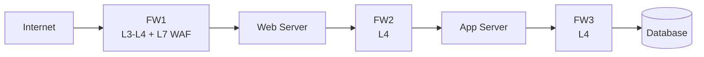
*Setiap lapisan hanya bisa bicara dengan lapisan di sampingnya lewat firewall khusus: FW1 di edge (L3-L4 + L7 WAF), FW2 (L4) antara web dan app, FW3 (L4) antara app dan database.*

Setiap lapisan hanya bisa bicara dengan lapisan di sampingnya — web server
tidak bisa langsung ke database. Aturan:

```bash
# FW1 (edge): WAN → web server (port 80/443)
# FW2 (internal): hanya web → app (port spesifik, misal 8080)
# FW3 (database): hanya app → DB (port 3306/5432)
```

## Fitur firewall lanjutan

### Deep Packet Inspection (DPI)

Tidak hanya melihat header — DPI melihat isi paket untuk menentukan
aplikasi:

```bash
# RouterOS DPI — blokir aplikasi tertentu
/ip/firewall/layer7-protocol/add name=tor regexp="tor.*\.onion"
/ip/firewall/filter/add chain=forward layer7-protocol=tor action=drop

# Atau dengan protokol yang dikenali RouterOS
/ip/firewall/filter/add chain=forward protocol=udp content="torrent" action=drop
```

> **Catatan**: DPI membutuhkan CPU signifikan. Jangan aktifkan di semua
> trafik tanpa pengukuran.

### Intrusion Prevention System (IPS)

IPS memonitor trafik dan secara aktif memblokir serangan — beda dengan IDS
yang hanya memberi peringatan.

- **Signature-based**: mencocokkan pola serangan yang dikenal (Snort,
  Suricata, Zeek).
- **Anomaly-based**: mendeteksi penyimpangan dari pola normal.
- **Protocol-based**: mencari pelanggaran RFC protokol.

Integrasi firewall + IPS:

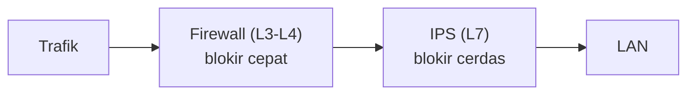
*Firewall melakukan blokir cepat di L3-L4 (ACL/stateful), lalu IPS memeriksa lebih dalam di L7 untuk mendeteksi pola serangan yang lebih halus.*

RouterOS versi 7 mendukung IPS dasar dengan *packet sniffer* dan skrip
deteksi, tapi untuk IPS serius, pasang Suricata/Snort di sistem terpisah.

### SSL / TLS inspection

Firewall memeriksa konten HTTPS dengan menjadi "man in the middle" yang sah:

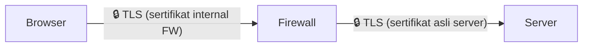
*Firewall menjadi "man in the middle" yang sah: satu sesi TLS terpisah ke browser (sertifikat internal) dan satu sesi TLS lain ke server asli, sehingga isi trafik HTTPS bisa diperiksa di tengah.*

**Cara kerja**:
1. Firewall mencegat koneksi HTTPS dari klien.
2. Firewall membuat koneksi HTTPS baru ke server asli.
3. Firewall membuat sertifikat palsu untuk domain tujuan, ditandatangani
   CA internal.
4. Klien melihat koneksi HTTPS yang sah (dengan CA internal).
5. Firewall membaca isi dalam bentuk teks biasa.

**Masalah**: *Certificate pinning* (beberapa aplikasi menolak sertifikat
yang tidak mereka kenali). Privasi pengguna (karyawan tidak suka HTTPS
mereka dibuka). Performa.

### Geolocation-based filtering

Blokir atau izinkan trafik berdasarkan negara:

```bash
# RouterOS — unduh database alamat IP per negara
/tool/fetch url="https://.../id.txt"
/ip/firewall/address-list/add list=indonesia address-file=id.txt

# Blokir akses SSH dari luar Indonesia
/ip/firewall/filter/add chain=input protocol=tcp dst-port=22 \
  src-address-list=!indonesia action=drop
```

> **Peringatan**: geolocation tidak akurat 100%. VPN dan cloud provider
> sering terdaftar di negara yang berbeda.

### Threat intelligence integration

Firewall modern bisa menerima *feed* ancaman otomatis:

- **Blocklist.de** — IP penyerang aktif (SSH, mail, web).
- **AlienVault OTX** — IOC global.
- **Abuse.ch (Feodo, SSL Blacklist, URLhaus)** — C2 server dan malware.
- **MISP** — platform intelijen ancaman komunitas.

```bash
# RouterOS — update address-list dari threat feed berkala (via script scheduler)
/tool/fetch url="https://feodotracker.abuse.ch/downloads/ipblocklist.csv"
:foreach i in=[/ip/firewall/address-list/find list=threat] do={
  /ip/firewall/address-list/remove $i
}
/import file-name=ipblocklist.csv
```

> Di RouterOS skenario di atas disederhanakan — dalam praktik, butuh
> ekstraksi data dengan script.

### User / Identity awareness

Kebijakan berdasarkan siapa, bukan hanya IP. Integrasi dengan Active
Directory, LDAP, RADIUS:

```bash
# RouterOS + RADIUS — user identity dari PPPoE atau Hotspot
/radius/add address=192.168.1.5 secret=radsec service=ppp
/ppp/profile/add name=karyawan remote-address=192.168.2.0/24

# Firewall aturan — blokir akses tertentu untuk group karyawan
/ip/firewall/filter/add chain=forward src-address=192.168.2.0/24 \
  dst-port=443 content="facebook" action=drop
```

Pada NGFW seperti FortiGate atau Palo Alto, identitas bisa langsung dari AD:
- User `bambang` → blokir media sosial jam kerja.
- User `dewi` → boleh akses database hanya dari IP tertentu.

## Prinsip desain aturan firewall

### Aturan emas

1. **Default deny** — segala sesuatu yang tidak diizinkan secara eksplisit
   harus ditolak. Bukan sebaliknya.
2. **Most specific first** — aturan yang paling spesifik diletakkan di atas.
3. **Least privilege** — berikan akses minimum yang diperlukan.
4. **Log everything at the bottom** — aturan `drop` terakhir jangan di-log
   (terlalu banyak). Log aturan `accept` yang penting.
5. **Group similar traffic** — gunakan address-list, port-list, atau
   objek grup untuk menyederhanakan.
6. **Review and audit** — aturan usang lebih berbahaya daripada tidak punya
   aturan.

### Contoh urutan aturan yang baik

<details>
<summary>Lihat pembahasan</summary>


```bash
# 1. Aturan connection tracking — harus di atas
/ip/firewall/filter/add chain=input connection-state=established,related action=accept
/ip/firewall/filter/add chain=input connection-state=invalid action=drop

# 2. Aturan management yang spesifik
/ip/firewall/filter/add chain=input protocol=tcp dst-port=22 \
  src-address-list=admin-ips action=accept log=yes

# 3. Aturan service (dari WAN)
/ip/firewall/filter/add chain=input protocol=tcp dst-port=80,443 \
  in-interface=wan1 action=accept

# 4. Blokir yang jelas-jelas mencurigakan
/ip/firewall/filter/add chain=input src-address-list=threat-intel action=drop \
  log=yes

# 5. Default deny — tanpa log
/ip/firewall/filter/add chain=input action=drop
```


</details>

### Kesalahan umum

| Kesalahan | Masalah | Perbaikan |
|-----------|---------|-----------|
| Aturan `accept` di bawah `drop` semua | Tidak pernah terpakai — *shadowed rule* | Aturan spesifik di atas |
| Port range terlalu lebar | `dst-port=1-65535` = tidak ada filtering | Tentukan port yang tepat |
| Action `reject` bukan `drop` | Memberi tahu penyerang bahwa port aktif | Pakai `drop` — jangan beri informasi |
| Tidak pakai `connection-state` | Setiap paket diperiksa semua aturan | Pasang `established,related` di paling atas |
| Lupa aturan `forward` | Hanya input terlindungi, forward terbuka lebar | Lindungi chain `forward` juga |

## Logging dan monitoring

### Apa yang perlu di-log

- **Login berhasil dan gagal** ke perangkat (SSH, WebFig, API).
- **Perubahan konfigurasi**.
- **Akses dari IP tak dikenal** ke port management.
- **Aturan `accept` untuk port publik** — lihat siapa yang mengakses.
- **Aturan `drop` spesifik** — untuk debugging, bukan untuk default drop.

```bash
# RouterOS — log aturan accept untuk SSH dari WAN
/ip/firewall/filter/add chain=input protocol=tcp dst-port=22 in-interface=wan1 \
  action=accept log=yes log-prefix="SSH-WAN: "
```

### Jebakan logging

Menyalakan `log=yes` di aturan `drop` default adalah resep bencana:

```bash
# ❌ JANGAN — firewall akan membanjiri storage dengan log sampah
/ip/firewall/filter/add chain=input action=drop log=yes

# ✅ Lebih baik: log hanya aturan drop yang spesifik, lalu default drop tanpa log
/ip/firewall/filter/add chain=input protocol=tcp dst-port=22 connection-state=new \
  src-address=!admin-ips action=drop log=yes log-prefix="BLOCKED-SSH: "
/ip/firewall/filter/add chain=input action=drop  # tanpa log
```

### Monitoring tools

| Alat | Fungsi | Di RouterOS |
|------|--------|-------------|
| `conntrack -L` | Lihat koneksi aktif | `/ip/firewall/connection/print` |
| `tcpdump` / `tshark` | Tangkap paket real-time | `/tool/sniffer/` |
| `nmap` | Port scanning dari luar | dari PC eksternal |
| SIEM (Wazuh, Splunk, Graylog) | Kumpulkan dan korelasi log | `/system/logging/action/add type=remote` |
| NetFlow / IPFIX / sFlow | Lihat siapa bicara ke mana | `/ip/firewall/connection/print` + skrip |
| Grafana + Telegraf | Dashboard metrik real-time | `/system/health/` + SNMP |

## Skenario deployment umum

### 1. ISP edge — BGP + firewall

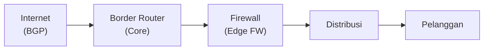
*Topologi ISP edge: border router menangani routing BGP inti, firewall edge menyaring akses sebelum trafik didistribusikan ke pelanggan.*

Tantangan:
- **Throughput tinggi**: kecepatan 1–100 Gbps — FastTrack atau hardware
  offloading mutlak.
- **BGP prefix list**: firewall tidak memproses routing, hanya akses.
- **DDoS scale**: firewall edge sering kewalahan; butuh upstream scrubbing
  (Cloudflare, Arbor).
- **Aturan sederhana**: blokir port berbahaya, izinkan layanan (DHCP, PPPoE,
  DNS).

```bash
# RouterOS sebagai ISP edge — firewall minimal
/ip/firewall/filter/add chain=forward connection-state=established,related action=accept
/ip/firewall/filter/add chain=forward connection-state=invalid action=drop
/ip/firewall/filter/add chain=forward protocol=tcp dst-port=23,135,139,445,3389 \
  action=drop log=yes  # port yang sering dipindai
/ip/firewall/filter/add chain=forward action=fasttrack-connection
/ip/firewall/filter/add chain=forward action=accept
```

### 2. Branch / kantor cabang

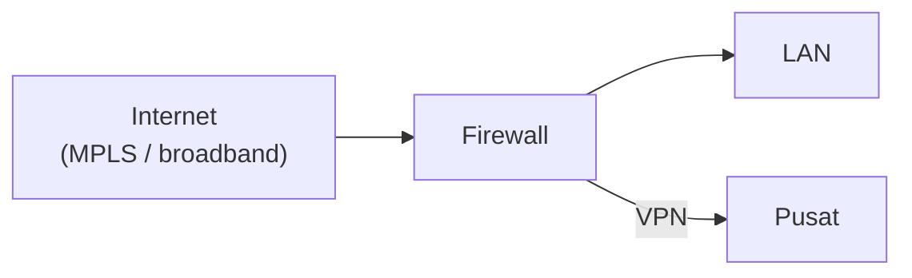
*Firewall kantor cabang meneruskan trafik lokal ke LAN sekaligus membuka tunnel VPN ke kantor pusat.*

Tantangan:
- **Manajemen terpusat**: The Dude, Ansible, atau TR-069.
- **VPN otomatis**: IPsec atau WireGuard tunnel ke pusat.
- **Failover**: dua koneksi WAN (utama + backup).
- **QoS**: prioritas trafik VPN dan VoIP di atas browsing.

```bash
# RouterOS branch — NAT + IPsec ke pusat
/ip/firewall/nat/add chain=srcnat out-interface=wan1 action=masquerade
/ip/firewall/nat/add chain=srcnat out-interface=ipsec-tun1 action=masquerade
/ip/firewall/filter/add chain=forward out-interface=ipsec-tun1 \
  connection-state=new action=accept
```

### 3. Data center

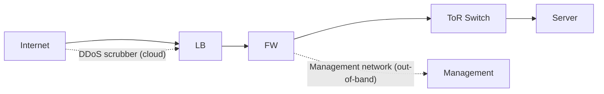
*Trafik data center melewati load balancer lalu firewall sebelum ke ToR switch dan server; DDoS scrubbing terjadi di cloud sebelum LB, dan jaringan manajemen terpisah (out-of-band) dari jalur data utama.*

Tantangan:
- **Aplikasi publik HTTP/HTTPS**: DNAT ke server internal.
- **Management terbatas**: hanya dari jump box (bastion).
- **Segmentation**: VLAN publik, privat, management, storage.
- **Rate limiting**: per IP, per aplikasi.
- **High availability**: firewall redundant.

```bash
# RouterOS DC — DNAT ke server web internal
/ip/firewall/nat/add chain=dstnat in-interface=wan1 protocol=tcp \
  dst-port=80,443 action=dst-nat to-addresses=10.0.1.10

# Rate limit — maks 5 koneksi baru per detik per IP
/ip/firewall/filter/add chain=forward in-interface=wan1 protocol=tcp \
  dst-port=80,443 connection-state=new \
  src-address-list=http-burst action=drop
/ip/firewall/address-list/add list=http-burst address=0.0.0.0/0 \
  timeout=1s
```

### 4. SOHO / rumah

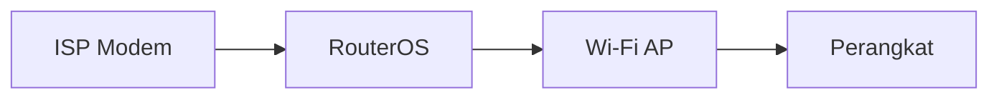
*Topologi SOHO sederhana: satu perangkat RouterOS sering merangkap NAT, firewall, dan Wi-Fi AP dalam satu kotak.*

Tantangan:
- **Setup sederhana**: masquerade + allow established + drop default.
- **DNS over HTTPS** untuk privasi.
- **VPN server** untuk akses dari luar.
- **Parental control**: blokir situs tertentu jam tertentu.

```bash
# RouterOS SOHO — aturan minimum
/ip/firewall/nat/add chain=srcnat out-interface=wan1 action=masquerade
/ip/firewall/filter/add chain=input connection-state=established,related action=accept
/ip/firewall/filter/add chain=input connection-state=invalid action=drop
/ip/firewall/filter/add chain=input in-interface=!lan1 action=drop  # tutup management dari WAN
/ip/firewall/filter/add chain=forward connection-state=established,related action=accept
/ip/firewall/filter/add chain=forward connection-state=invalid action=drop
/ip/firewall/filter/add chain=forward action=fasttrack-connection
/ip/firewall/filter/add chain=forward action=accept
```

## Troubleshooting

### 1. Periksa urutan aturan

```bash
# Pratinjau aturan dengan nomor baris
/ip/firewall/filter/print detail
/ip/firewall/filter/print stats  # lihat hit count

# Apakah aturan baru punya hit = 0? Mungkin shadowed oleh aturan di atasnya.
```

### 2. Periksa conntrack

```bash
# Apakah koneksi yang diharapkan ada?
/ip/firewall/connection/print where src-address=192.168.1.100

# Apakah tabel penuh?
/ip/firewall/connection/print count
/ip/firewall/connection/tracking/print
```

Conntrack penuh → koneksi baru ditolak meskipun aturan mengizinkan.

### 3. Packet sniffer

```bash
# RouterOS — tangkap paket di interface tertentu
/tool/sniffer/quick interface=wan1 ip-protocol=tcp port=443
/tool/sniffer/quick interface=lan1 host=192.168.1.100
```

### 4. Firewall hit count

Lihat aturan mana yang paling sering dipicu:

```bash
# RouterOS — aturan dengan hit terbanyak (indikasi masalah)
/ip/firewall/filter/print stats where disabled=no

# Di iptables:
iptables -L -n -v
```

### 5. Uji dari luar

```bash
# Dari PC eksternal:
nmap -sS -p 22,80,443,8080 your-public-ip
nmap -sU -p 53 your-public-ip

# Pastikan hanya port yang diizinkan yang terbuka.
# Port management (22, 8291, 8080) harus TERTUTUP dari WAN (filtered/dropped).
```

### 6. Troubleshooting checklist

| Gejala | Cek |
|--------|-----|
| Koneksi baru ditolak | Conntrack penuh? Aturan `established` di atas? |
| Akses dari WAN timeout | Aturan NAT sudah benar? Filter chain `forward`? |
| VPN terputus-putus | Conntrack timeout terlalu pendek? MTU? |
| Lambat dari yang diharapkan | FastTrack? QoS sudah diatur? CPU overload? |
| Log penuh dalam 5 menit | Aturan `drop` dengan `log=yes` yang terlalu umum? |

## Performa dan tuning

### FastTrack (RouterOS)

FastTrack adalah *connection offloading* — setelah koneksi terbentuk,
paket diteruskan langsung di kernel tanpa evaluasi aturan:

```bash
/ip/firewall/filter/add chain=forward action=fasttrack-connection \
  connection-state=established,related
# Aturan ini harus di atas aturan forward lainnya
/ip/firewall/filter/add chain=forward connection-state=established,related action=accept
```

**Kondisi FastTrack aktif**:
- Hanya TCP dan UDP.
- Tidak ada aturan NAT (kecuali masquerade/snat sederhana).
- Tidak ada DPI, queue, atau IPS di koneksi tersebut.
- Interface bukan bridge.

FastTrack bisa meningkatkan throughput puluhan kali lipat (100 Mbps → 1 Gbps
di CPU yang sama).

### Aturan vs throughput

Semakin banyak aturan, semakin banyak siklus CPU per paket. Praktik terbaik:

1. Aturan `established,related` di paling atas — 90%+ paket hanya kena
   aturan ini.
2. Aturan `invalid` berikutnya.
3. FastTrack setelah itu.
4. Aturan spesifik (NAT, service, blokir) yang hanya dievaluasi untuk koneksi
   `NEW`.

Dengan urutan ini, aturan ke-3–100 hanya dievaluasi untuk sebagian kecil
paket.

### Hardware acceleration

- **RouterOS + x86**: FastTrack + multi-core scaling.
- **RouterBoard**: hardware offloading untuk switching (switch chip).
- **MikroTik CRS3xx**: L3 hardware offloading.
- **Linux + iptables/nftables**: RSS, XDP, eBPF.

## Hardening firewall management

Firewall itu sendiri adalah target. Amankan akses manajemennya:

```bash
# RouterOS — akses management hanya dari LAN atau VPN
/ip/firewall/filter/add chain=input connection-state=established,related action=accept
/ip/firewall/filter/add chain=input connection-state=invalid action=drop
/ip/firewall/filter/add chain=input protocol=tcp dst-port=22,8291 \
  in-interface=!lan1 action=drop

# Lebih ketat — hanya dari IP admin tertentu
/ip/firewall/filter/add chain=input src-address-list=mgmt-allowed action=accept
/ip/firewall/filter/add chain=input action=drop

# Matikan service yang tidak dipakai
/ip/service/set telnet disabled=yes
/ip/service/set ftp disabled=yes
/ip/service/set www disabled=yes   # HTTP webfig
/ip/service/set api disabled=yes
/ip/service/set api-ssl disabled=yes
```

### Best practice management

1. **Gunakan SSH key**, bukan password untuk akses management.
2. **Buat user akun individual** — jangan login semua sebagai `admin`.
3. **Audit log akses** secara rutin.
4. **Ubah port SSH standar (22)**? Debatable — lebih baik pakai `src-address-list`
   ketat daripada *security by obscurity*.
5. **Backup konfigurasi rutin** — dan simpan di tempat terpisah.
6. **Patch firmware secara berkala** — firewall = software, punya bug.

## Cek pemahaman

<details>
<summary>Lihat jawaban</summary>


1. Sebuah server web di DMZ bisa mengakses database di LAN. Apa masalahnya?
   <br>→ DMZ → LAN harusnya **ditolak**. Server DMZ yang dibobol memberi
   akses langsung ke database. Aturannya: DMZ → LAN = `action=drop`.

2. Aturan firewall sudah benar tapi koneksi baru dari WAN tetap ditolak.
   Conntrack tidak penuh. Apa yang salah? <br>→ Mungkin stateful rule
   `established,related` di chain `forward` tidak ada, atau aturan `accept`
   di `forward` untuk koneksi `NEW` belum dibuat.

3. Di RouterOS, kenapa FastTrack harus diletakkan di atas aturan `accept`
   `forward`? <br>→ FastTrack berfungsi setelah koneksi `established`. Ia
   harus dicocokkan sebelum aturan lain. Tanpa FastTrack, setiap paket dalam
   koneksi established tetap dievaluasi terhadap semua aturan.

4. Apa perbedaan aturan `reject` dan `drop`? Kapan pakai yang mana?
   <br>→ `reject` mengirim balasan TCP RST atau ICMP unreachable
   (memberi tahu penyerang ada perangkat di sana). `drop` diam tanpa balasan.
   **Pakai `drop`** kecuali punya alasan kuat untuk `reject`.

5. Untuk ISP edge dengan throughput 10 Gbps, apakah FastTrack di RouterOS
   x86 bisa menangani? <br>→ Tergantung CPU. FastTrack bisa mencapai 2–10
   Gbps di CPU modern multi-core. Di atas 10 Gbps, butuh hardware offloading
   atau dedicated firewall ASIC. Juga pertimbangkan DPDK atau VPP.

---

::: tip Praktik langsung
Semua konsep di halaman ini diterapkan di [Firewall & QoS MikroTik](/mikrotik/firewall-qos).
:::

</details>