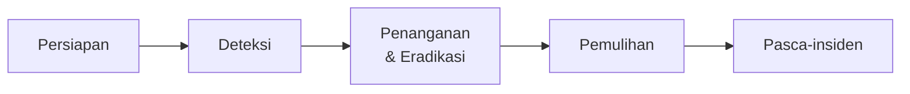

# Keamanan Jaringan — Lanjutan

Halaman ini melanjutkan [Keamanan Jaringan](/networking/keamanan) — dari teori
pertahanan ke praktik operasional: bagaimana mengelola risiko, merespons
serangan, mengamankan aplikasi dan surel, serta mengenali standar keamanan
yang mengatur profesi ini.

## Manajemen risiko: melindungi yang berharga

Keamanan bukan tentang menghilangkan semua risiko — itu mustahil. Ia tentang
**memahami** risiko dan memutuskan mana yang diterima, mana yang ditangani.

### Langkah-langkahnya

1. **Aset** — apa yang berharga? Data pelanggan, konfigurasi router, reputasi.
2. **Ancaman** — dari siapa? Hacker, malware, karyawan tidak puas, bencana alam.
3. **Kerentanan** — celah apa yang dimiliki? Firmware lawas, kata sandi lemah.
4. **Dampak** — jika terjadi, apa ruginya? Kebocoran data, downtime.
5. **Probabilitas** — seberapa mungkin terjadi? Server publik lebih mungkin
   diserang daripada server internal.

Setelah dinilai, setiap risiko mendapat satu dari empat tanggapan:

| Tanggapan | Arti | Contoh |
|-----------|------|--------|
| **Mitigasi** | Pasang kontrol untuk memperkecil risiko | Firewall, patch, enkripsi |
| **Transfer** | Pindahkan ke pihak lain | Asuransi siber, kontrak SLA keamanan |
| **Hindari** | Hentikan aktivitas berisiko | Cabut layanan usang yang tak bisa diamankan |
| **Terima** | Sadari risikonya dan pantau | Router di kantor kecil tanpa backup internet — risikonya diterima |

::: tip Threat modeling: STRIDE
STRIDE adalah metode memetakan ancaman per jenis, mudah diingat:

| Huruf | Ancaman | Contoh |
|-------|---------|--------|
| **S** | *Spoofing* — berpura-pura jadi orang lain | IP spoofing, phishing |
| **T** | *Tampering* — mengubah data di tengah jalan | ARP spoofing, MITM |
| **R** | *Repudiation* — menyangkal telah melakukan | Log tanpa signature |
| **I** | *Information disclosure* — data bocor | Sniffing, SQL injection |
| **D** | *Denial of service* — layanan lumpuh | DDoS, SYN flood |
| **E** | *Elevation of privilege* — naik hak akses | Zero-day di sistem operasi |
:::

## Respon insiden: ketika pertahanan jebol

Bukan soal **apakah** akan terjadi, tapi **kapan**. Miliki rencana:

### 1. Persiapan
- Nomor kontak darurat tim teknis & manajemen.
- Akses offline ke konfigurasi dan backup.
- Alat forensik siap pakai (capture, log, image disk).

### 2. Deteksi & analisis
- Gejala: trafik aneh, login gagal massal, alarm IDS, komplain pelanggan.
- Kumpulkan bukti: log, tangkapan paket, *memory dump*.
- Tentukan jenis, cakupan, dan dampak.

### 3. Penanganan & pemberantasan
- Isolasi: cabut kabel, nonaktifkan port VLAN, blokir IP di firewall.
- Jika router/switch terinfeksi: reboot ke konfigurasi bersih dari backup
  sebelum insiden. Netinstall jika perlu.
- Ganti kredensial yang bocor.

### 4. Pemulihan
- Kembalikan layanan dari backup bersih.
- Pantau untuk tanda-tanda penyerang kembali (banyak insiden kambuh).
- Komunikasikan ke pengguna/pelanggan.

### 5. Pasca-insiden
- *Post-mortem*: apa yang terjadi, apa yang bekerja, apa yang tidak.
- Perbaiki prosedur, perketat kontrol.



## Keamanan surel: SPF, DKIM, DMARC

Tiga rekaman DNS yang membuat surel domainmu lebih sulit dipalsukan. Wajib
dipasang oleh siapa pun yang mengelola domain.

**SPF** — *Sender Policy Framework*. Daftar server yang sah mengirim surel
atas nama domainmu:

```text
example.com.  TXT  "v=spf1 ip4:203.0.113.10 include:_spf.google.com ~all"
```

- `ip4:203.0.113.10` — IP server surelmu.
- `include:_spf.google.com` — Google Workspace juga sah.
- `~all` — semua yang lain *softfail* (ditandai tapi tidak ditolak).
- `-all` — *hardfail* (ditolak). Mulai dengan `~all`, naik ke `-all` setelah
  yakin konfigurasi benar.

**DKIM** — *DomainKeys Identified Mail*. Tanda tangan digital di setiap
surel keluar. Penerima memverifikasi dengan kunci publik di DNS:

```text
default._domainkey.example.com.  TXT  "v=DKIM1; k=rsa; p=MIGfMA0G..."
```

- Dihasilkan oleh server surelmu (Google, Outlook, atau server sendiri).

**DMARC** — *Domain-based Message Authentication, Reporting & Conformance*.
Memberi tahu penerima apa yang harus dilakukan jika SPF dan/atau DKIM gagal:

```text
_dmarc.example.com.  TXT  "v=DMARC1; p=quarantine; rua=mailto:dmarc@example.com"
```

- `p=none` → pantau saja (mulai di sini). `p=quarantine` → tandai spam.
  `p=reject` → tolak. Naik bertahap setelah laporan tidak menunjukkan
  surel sah yang gagal.

::: warning Kenapa ini penting bagi network engineer
Domain emailmu dipakai phishing, ISP/cloud memblokir seluruh domainmu — dan
tiket insiden jatuh ke mejamu. SPF/DKIM/DMARC mencegah itu.
:::

## Keamanan aplikasi web: OWASP Top 10 (sekilas)

Sebagai network engineer, kamu tidak menulis kode web — tapi kamu mengelola
infrastruktur tempat ia berjalan. Kenali celah paling umum agar bisa
membantu tim pengembang mengamankannya:

| Celah | Cara kerja | Yang bisa kamu lakukan |
|-------|------------|----------------------|
| **SQL Injection** | Input pengguna dieksekusi sebagai query SQL | Firewall WAF, parameterisasi di sisi aplikasi |
| **XSS** | Skrip jahat dimasukkan ke halaman web | Content-Security-Policy header, validasi input |
| **CSRF** | Klik link = eksekusi aksi atas nama korban | Anti-CSRF token, SameSite cookie |
| **SSRF** | Server dipaksa mengakses internal network | Batasi akses keluar server dengan firewall |
| **Insecure Direct Object Reference** | Akses file/data dengan mengubah ID URL | Otentikasi di sisi aplikasi, segmentasi |

Tiga hal yang langsung bisa kamu lakukan tanpa menyentuh kode:

1. **WAF** — Web Application Firewall (ModSecurity, Cloudflare) menyaring
   serangan L7 sebelum sampai ke server.
2. **Content Security Policy** — header HTTP yang membatasi sumber daya apa
   yang boleh dimuat browser.
3. **API gateway** — titik masuk tunggal yang menerapkan autentikasi,
   rate limiting, dan logging sebelum permintaan mencapai layanan.

## Keamanan nirkabel: lebih dari sekadar kata sandi

Wi-Fi menyiarkan data lewat udara — siapa pun dalam jangkauan bisa
mendengarkan. Lapisan pertahanannya:

### Enkripsi
- **WPA3** — standar terbaru (2018). Wajib untuk perangkat baru.
  Mengganti handshake 4-way WPA2 dengan SAE (*Simultaneous Authentication of
  Equals*) yang kebal serangan tebak kata sandi offline.
- **WPA2** — masih aman dengan kata sandi kuat. Rentan terhadap
  *KRACK* (2017) — sebagian besar perangkat sudah ditambal.
- **WPA/WEP** — **rusak total**. Jangan dipakai. Siapa pun bisa membobolnya
  dalam hitungan menit.

### 802.1X / RADIUS — autentikasi per pengguna
Gantikan kata sandi Wi-Fi bersama dengan kredensial individu:

- Setiap pengguna punya username & password sendiri.
- Saat tersambung, access point meneruskannya ke server RADIUS (FreeRADIUS,
  NPS, JumpCloud) untuk verifikasi.
- Dicabut akses satu pengguna tanpa mengganti kata sandi semua orang.

### Rogue AP dan evil twin
- **Rogue AP** — access point nakal yang dipasang tanpa izin di jaringanmu.
  Bisa jadi pintu belakang.
- **Evil twin** — AP palsu dengan SSID yang sama persis dengan AP asli.
  Korban tersambung ke penyerang secara sukarela.
- Pertahanan: *wireless intrusion prevention* (WIPS), pemindaian RF berkala,
  kebijakan "tidak boleh pasang AP pribadi".

## Identity & Access Management (IAM)

Siapa boleh apa, kapan, dari mana, dan bagaimana cara membuktikannya.

### RBAC — Role-Based Access Control

Bukan "User A = boleh ini, User B = boleh itu" satu per satu, melainkan
**peran**:

| Peran | Hak akses | Contoh jabatan |
|-------|-----------|----------------|
| Admin infrastruktur | Semua perangkat jaringan | Network engineer senior |
| Operator | Baca + restart + backup | Teknisi NOC |
| Helpdesk | Baca status, tidak bisa konfigurasi | Support L1 |
| Auditor | Baca semua log, tidak bisa apa-apa | Auditor eksternal |

Di RouterOS ini diwujudkan dengan *policy* di `/user/group`.

### MFA — Multi-Factor Authentication

Tiga faktor autentikasi:

- **Sesuatu yang kamu tahu** — kata sandi, PIN.
- **Sesuatu yang kamu miliki** — ponsel (TOTP), token HW, kunci FIDO2.
- **Sesuatu yang kamu adalah** — sidik jari, wajah.

MFA mengamankan login SSH, VPN, WebFig, dan panel administrasi. Tanpa MFA,
kata sandi yang bocor = akses penuh. Dengan MFA, kata sandi bocor saja
belum cukup.

### SSO — Single Sign-On

Satu kali login (biasanya dengan MFA) = akses ke banyak sistem. Protokol
utama: SAML, OAuth 2.0, OpenID Connect. Tidak langsung terkait perangkat
jaringan, tetapi kamu akan mengelolanya jika perangkatmu mendukung RADIUS
yang terintegrasi dengan SSO (Azure AD, Okta, JumpCloud).

## Pusat operasi keamanan (SOC) dan SIEM

**SOC** — tim yang memantau keamanan 24/7. **SIEM** — alat yang mereka
pakai (Splunk, Wazuh, Elastic Security, QRadar).

### Cara kerja SIEM
1. **Kirim log** dari semua perangkat (router, switch, firewall, server) ke
   SIEM — di RouterOS: `/system/logging/action/add type=remote`.
2. **Normalisasi** — log dalam format berbeda diseragamkan.
3. **Korelasi** — puluhan login gagal dari satu IP dalam 5 menit = serangan
   brute-force.
4. **Peringatan** — notifikasi ke SOC via surel, Telegram, atau dashboard.

### Log apa yang wajib dikirim dari perangkat jaringan
- Login gagal dan berhasil (user, asal IP, waktu).
- Perubahan konfigurasi (`/system/history` atau `/log` dengan topic=system).
- Perubahan interface (up/down).
- Aturan firewall yang di-trigger (atur dengan `log=yes`).
- Sesi VPN naik/turun.

```bash
# Contoh kirim log ke SIEM dari RouterOS
/system/logging/action/add name=ke-siem type=remote remote=192.0.2.100
/system/logging/add topics=info,error action=ke-siem
/system/logging/add topics=firewall,action=ke-siem
```

## Enkripsi data: tidak hanya di transport

### Data dalam perjalanan (*in transit*)
Dilindungi oleh TLS (HTTPS), SSH, IPsec, WireGuard. Sudah umum.

### Data saat disimpan (*at rest*)
- Disk router: fitur *disk encryption* terbatas di RouterOS; untuk data
  sensitif, jangan simpan di perangkat.
- Backup: beri `password=` di `/system/backup/save` dan simpan di tempat
  aman.
- Server/file server: enkripsi disk penuh (LUKS, BitLocker) + enkripsi file
  individual.

### Public Key Infrastructure (PKI)
PKI adalah sistem yang menerbitkan, mendistribusikan, dan mencabut
sertifikat digital:

- **CA** (*Certificate Authority*) — penerbit sertifikat. Bisa publik
  (Let's Encrypt, DigiCert) atau internal (untuk VPN perusahaan).
- **Sertifikat** — mengikat identitas (domain, nama perangkat) ke kunci
  publik, ditandatangani CA.
- **CRL/OCSP** — daftar sertifikat yang dicabut.
- Di RouterOS: `/certificate/` — untuk DoH, WebFig HTTPS, dan IPsec.

## Standar dan kepatuhan

Sebagai network engineer, kamu mungkin diminta mendesain jaringan yang
memenuhi standar berikut. Pahami garis besarnya:

| Standar | Fokus | Relevansi untuk network |
|---------|-------|------------------------|
| **ISO 27001** | Sistem manajemen keamanan informasi (SMMI/SMKI) | Dokumentasi prosedur, kontrol akses jaringan, logging, backup |
| **PCI DSS** | Keamanan data kartu pembayaran | Segmentasi ketat, firewall, enkripsi, logging, pembatasan akses |
| **UU ITE** | Hukum siber Indonesia | Kewajiban melaporkan pelanggaran data, perlindungan data pribadi |
| **UU PDP** | Perlindungan data pribadi | Enkripsi data, izin subjek data, batas penyimpanan |
| **NIST CSF** | Kerangka kerja keamanan siber AS (identify, protect, detect, respond, recover) | Acuan desain program keamanan dari nol |

Tidak semua organisasi harus memenuhi semuanya — kamu perlu mencari tahu
mana yang *wajib* untuk industrimu.

## Uji penetrasi: kenali kelemahan sebelum penyerang

*Penetration testing* adalah serangan simulasi untuk menemukan celah. Metodologi
standar:

1. **Reconnaissance** — kumpulkan informasi (domain, IP, teknologi).
2. **Pemindaian** — port scanner (Nmap), service detection, vulnerability
   scanner (Nessus, OpenVAS).
3. **Eksploitasi** — coba bobol melalui celah yang ditemukan.
4. **Pasca-eksploitasi** — apa yang bisa dilakukan setelah masuk?
   *Lateral movement*, *privilege escalation*.
5. **Laporan** — celah ditemukan, tingkat keparahan, rekomendasi perbaikan.

::: tip Saran untuk network engineer
Jalankan pemindaian rutin terhadap jaringan yang kamu kelola:

```bash
nmap -sV -p 22,80,443,8080 192.0.2.0/24    # layanan apa saja yang terbuka?
nmap --script=vuln 203.0.113.0/24            # scanner kerentanan dasar
```

Gunakan alat yang sama yang dipakai penyerang — supaya kamu menemukan
celah sebelum mereka.
:::

## Keamanan fisik

Tidak ada firewall terbaik yang menolong kalau penyerang bisa masuk ke
ruang server:

- **Kontrol akses fisik** — kartu akses, biometrik, log kunjungan.
- **Pemantauan** — CCTV di setiap pintu dan rak.
- **UPS & generator** — server mati listrik = availability jebol.
- **Anti-tamper** — segel pada perangkat yang menandai jika dibuka.
- **Prosedur** — tamu didampingi, servis vendor dijadwalkan dan diawasi.

Di lingkungan VSAT/remote: terminal di atap gereja atau desa terpencil
sering tanpa pengaman fisik. Solusinya:
- RouterOS di dalam lemari terkunci, bukan di ruang terbuka.
- Login default diganti (jangan `admin` tanpa sandi).
- MAC-telnet dimatikan di sisi remote (`/tool/mac-server/set`).
- Jika dicuri, tidak ada data di perangkat (konfigurasi tanpa password
  ada di backup — bukan di perangkat).

## Intelijen ancaman (*threat intelligence*)

Mengetahui musuh dan alatnya membuat pertahanan lebih tajam:

- **IOC** (*Indicators of Compromise*) — IP, domain, hash file yang terkait
  serangan. Blokir di firewall/address-list.
- **TTP** (*Tactics, Techniques & Procedures*) — cara kerja penyerang:
  "mereka masuk lewat RDP terbuka, pasang ransomware, minta tebusan."
  Merubah TTP butuh perubahan prosedur, bukan sekadar blokir IP.
- **Sumber** — feed gratis: AlienVault OTX, IBM X-Force, MISP; berbagai
  komunitas ISP Indonesia.

```bash
# Di RouterOS: blokir IOC via address-list (contoh)
/ip/firewall/address-list/add list=threat-intel address=185.220.101.0/24
/ip/firewall/filter/add chain=input src-address-list=threat-intel action=drop
```

::: info Keamanan rantai pasok (*supply chain security*)
Perangkat jaringan baru datang dari pabrik — siapa yang menjamin tidak ada
celah atau pintu belakang sejak lahir? Praktik minimal:

1. Update firmware segera setelah menerima perangkat (jangan pakai versi
   pabrik).
2. Reset ke konfigurasi bersih (jangan pakai *default config*).
3. Audit hash file firmware dari situs resmi.
4. Beli dari distributor resmi, bukan "teman punya teman".
:::

## Cek pemahaman

<details>
<summary>Lihat jawaban</summary>


1. Domain email perusahaanmu sering dipakai phishing. Rekaman DNS apa yang
   harus segera dipasang? <br>→ **SPF** (siapa yang sah kirim surel),
   **DKIM** (tanda tangan verifikasi), **DMARC** (perintah ke penerima).
   Naik dari `p=none` ke `p=reject` bertahap.

2. Tim pengembang melaporkan server web `203.0.113.5` sering diserang SQL
   injection. Apa yang bisa kamu lakukan dari sisi jaringan? <br>→ Pasang
   **WAF** di depan server, atau blokir pola serangan di firewall L7.
   Tapi solusi permanen tetap di sisi aplikasi (parameterized query).

3. Sebuah AP berpindah lokasi dan ditempel di meja resepsionis tanpa
   sepengetahuan IT. Ancaman apa ini? <br>→ **Rogue AP** — potensi pintu
   belakang ke jaringan internal. Atasi dengan pemindaian RF, WIPS, dan
   kebijakan "dilarang pasang AP pribadi".

4. Kamu menerima notifikasi SIEM: 1.500 login gagal ke SSH router dari IP
   asing dalam 3 menit. Langkah pertama? <br>→ Blokir IP tersebut di
   firewall (address-list dinamis atau manual). Ini pola brute-force.
   Jangan tunggu sampai berhasil.

5. Backup konfigurasi yang disimpan di cloud — apakah sudah cukup aman?
   <br>→ Belum: pastikan backup dienkripsi (`password=`), dan *restore*
      pernah diuji. Backup yang tidak bisa di-restore bukan backup.

</details>