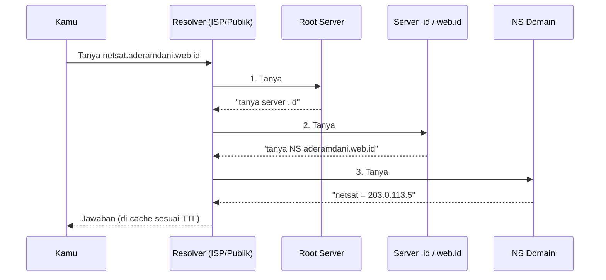

# Protokol Jaringan

Protokol adalah kesepakatan format dan urutan pesan antara dua pihak yang
berkomunikasi. Halaman ini membedah protokol-protokol yang menopang pengalaman
internet sehari-hari: TCP, UDP, DNS, DHCP, HTTP/HTTPS, dan beberapa protokol
pendukung yang bekerja di belakang layar.

## TCP vs UDP

Dua kuda beban lapisan transport — sudah diperkenalkan di
[Model TCP/IP](/networking/model-tcp-ip#lapisan-transport-ujung-ke-ujung),
di sini kita pertajam perbandingannya:

| Aspek | TCP | UDP |
| --- | --- | --- |
| Koneksi | Ya (three-way handshake) | Tidak |
| Jaminan sampai | Ya (ACK + retransmisi) | Tidak |
| Urutan terjaga | Ya | Tidak |
| Kendali kemacetan | Ya | Tidak |
| Overhead header | 20–60 byte | 8 byte |
| Cocok untuk | Web, email, transfer file, SSH | VoIP, video call, game, DNS, NTP |

Aturan praktis: kalau data **harus lengkap** (file, halaman web), pakai TCP.
Kalau data **harus segar** dan yang telat lebih baik dibuang (suara, video
langsung, posisi pemain game), pakai UDP — aplikasilah yang menangani sisanya.

## DNS

DNS (*Domain Name System*) menerjemahkan nama (`netsat.aderamdani.web.id`)
menjadi alamat IP. Tanpa DNS, internet tetap jalan — tapi kamu harus hafal
angka.

### Hierarki dan proses resolusi

DNS adalah basis data terdistribusi berbentuk pohon: **root** → **TLD**
(`.id`, `.com`) → **domain** (`web.id`, `aderamdani.web.id`) → seterusnya.



Resolver menyimpan jawaban di *cache* selama TTL rekaman — karena itulah
perubahan DNS "butuh waktu menyebar".

Perhatikan pembagian kerjanya: komputermu hanya bertanya sekali ke resolver
(**query rekursif** — "carikan sampai dapat"), dan resolver-lah yang rajin
menelusuri pohon dari root ke bawah (**query iteratif** — tiap server hanya
menjawab "tanya yang di bawah sana"). Resolver bisa milik ISP, atau publik
seperti `8.8.8.8` (Google), `1.1.1.1` (Cloudflare), `9.9.9.9` (Quad9).

::: tip DNS di link satelit
Satu resolusi DNS bisa memakan beberapa RTT. Di link
[GEO](/satelit/orbit#geo-geostationary-orbit) itu berarti *detik*, dirasakan
sebagai "loading" sebelum situs mulai terbuka. Karena itu jaringan VSAT hampir
selalu menaruh **DNS cache lokal** di sisi remote — praktiknya di
[DNS router MikroTik](/mikrotik/dhcp-dns-nat#dns-router-sebagai-cache).
:::

### Jenis rekaman penting

| Rekaman | Isi | Contoh |
| --- | --- | --- |
| A | Nama → IPv4 | `netsat A 203.0.113.5` |
| AAAA | Nama → IPv6 | `netsat AAAA 2001:db8::5` |
| CNAME | Nama → nama lain (alias) | `netsat CNAME xxx.vercel-dns.com` |
| MX | Server email domain | `@ MX 10 mail.example.com` |
| TXT | Teks bebas (verifikasi, SPF/DKIM) | `"v=spf1 ..."` |
| NS | Server otoritatif zona | `@ NS ns1.example-dns.com` |

Situs ini sendiri hidup dari satu rekaman **CNAME**:
`netsat.aderamdani.web.id → dns Vercel`, persis pola di tabel.

```bash
dig netsat.aderamdani.web.id +short   # uji resolusi dari terminal
```

## DHCP

DHCP (*Dynamic Host Configuration Protocol*) memberi perangkat konfigurasi
jaringan secara otomatis: alamat IP, subnet mask, gateway, dan server DNS.
Prosesnya empat langkah — **DORA**:

| Singkatan | Pesan | Arah | Keterangan |
| :---: | :--- | :---: | :--- |
| **D** | `DISCOVER` | Klien ──▶ Server | *Broadcast*: "Apakah ada server DHCP di jaringan ini?" |
| **O** | `OFFER` | Server ──▶ Klien | Tawaran IP (misal: `192.168.1.50`) |
| **R** | `REQUEST` | Klien ──▶ Server | "Saya terima tawaran IP tersebut" |
| **A** | `ACK` | Server ──▶ Klien | Konfirmasi sah (berisi durasi sewa / *lease time*) |

Alamat bersifat **sewa** (*lease*); klien memperpanjang di tengah masa sewa.
Kalau tidak ada server DHCP yang menjawab, perangkat memberi dirinya alamat
darurat `169.254.x.x` — tanda klasik "jaringan bermasalah" saat troubleshooting.

Dua praktik lapangan yang perlu dikenal:

- **Static lease / reservation** — MAC tertentu selalu diberi IP yang sama.
  Cara terbaik memberi "alamat tetap" untuk printer, kamera, dan server kecil
  tanpa mengetik konfigurasi manual di tiap perangkat.
- **DHCP hanya bekerja di broadcast domain-nya.** DISCOVER adalah broadcast,
  jadi tidak melewati router. Jaringan ber-VLAN banyak memakai **DHCP relay**
  di tiap segmen yang meneruskan permintaan ke satu server pusat.

Dan satu jebakan klasik: **dua server DHCP di satu jaringan** (misalnya ada
yang iseng mencolok router rumah ke LAN kantor) membuat sebagian perangkat
mendapat konfigurasi yang salah — gejalanya acak dan menyebalkan; obatnya
*DHCP snooping* di switch atau disiplin di lapangan.

## HTTP dan HTTPS

HTTP (*HyperText Transfer Protocol*) adalah protokol permintaan-balasan di
balik web:

```http
GET /networking/protokol HTTP/1.1
Host: netsat.aderamdani.web.id

HTTP/1.1 200 OK
Content-Type: text/html; charset=utf-8

<!DOCTYPE html>...
```

Metode utama: `GET` (ambil), `POST` (kirim), `PUT`/`PATCH` (ubah), `DELETE`.
Kode status: `2xx` sukses, `3xx` pengalihan, `4xx` salah dari klien
(404 = tidak ada), `5xx` salah dari server.

### HTTPS = HTTP + TLS

TLS menambahkan tiga jaminan: **kerahasiaan** (enkripsi), **integritas**
(data tak diubah di jalan), dan **autentikasi** (sertifikat membuktikan kamu
bicara dengan server asli, dijamin rantai *Certificate Authority*). Handshake
TLS 1.3 hanya butuh 1 RTT sebelum data mengalir.

### Evolusi versi

| Versi | Transport | Pembeda utama |
| --- | --- | --- |
| HTTP/1.1 | TCP | Satu permintaan menunggu yang lain (head-of-line blocking) |
| HTTP/2 | TCP | Multiplexing banyak permintaan dalam satu koneksi |
| HTTP/3 | **QUIC (UDP)** | Handshake lebih singkat, tanpa HOL blocking di transport |

::: tip Hitung RTT-mu
Membuka satu halaman HTTPS baru butuh minimal: 1 RTT (TCP) + 1 RTT (TLS 1.3)
+ 1 RTT (HTTP) ≈ **3 RTT** sebelum byte pertama tampil. Di serat optik
antarkota (RTT 20 ms) itu 60 ms — tak terasa. Di link
[GEO](/satelit/orbit#geo-geostationary-orbit) (RTT 500 ms) itu **1,5 detik**
hanya untuk memulai. HTTP/3 dan *TLS session resumption* memangkas ini —
contoh nyata desain protokol modern yang "sadar latensi".
:::

## Protokol pendukung yang jarang disadari

- **ICMP** — kurir pesan kontrol IP: "tujuan tak terjangkau", "TTL habis".
  `ping` dan `traceroute` dibangun di atasnya.
- **NTP** — sinkronisasi jam. Sepele? Sertifikat TLS, log keamanan, dan
  sistem terdistribusi rusak tanpa jam yang akur. Sumber waktu utamanya:
  jam atom, termasuk yang dibawa [satelit GNSS](/satelit/orbit#meo-medium-earth-orbit).
- **SMTP / IMAP** — kirim dan baca email antar-server dan ke klien.
- **SSH** — remote shell terenkripsi, port 22; juga tunneling dan transfer
  file (SFTP).

## Melihat protokol dengan mata kepala

Cara terbaik memahami protokol adalah menyaksikannya:

```bash
dig +trace example.com        # saksikan resolusi DNS dari root ke bawah
curl -v https://example.com   # saksikan handshake TLS + transaksi HTTP
ss -tunap                     # koneksi TCP/UDP yang sedang hidup
```

Untuk menyelam lebih dalam, **Wireshark** menampilkan isi tiap paket lapis per
lapis — ARP, DHCP DORA, TCP handshake, semua yang dibahas modul ini terlihat
telanjang di sana. Sangat dianjurkan dicoba minimal sekali.

## Contekan port yang wajib hafal

| Port | Protokol | Layanan |
| --- | --- | --- |
| 22 | TCP | SSH |
| 25 / 465 / 587 | TCP | SMTP (kirim email) |
| 53 | UDP+TCP | DNS |
| 67/68 | UDP | DHCP (server/klien) |
| 80 / 443 | TCP (443 juga QUIC/UDP) | HTTP / HTTPS |
| 123 | UDP | NTP |
| 143 / 993 | TCP | IMAP / IMAPS |
| 3389 | TCP | RDP (remote desktop Windows) |

## Cek pemahaman

1. Kamu mengganti rekaman A domainmu, tapi sebagian pengunjung masih diarahkan
   ke server lama selama beberapa jam. Kenapa?
2. Laptop mendapat IP `169.254.100.7`. Apa artinya dan apa langkah pertamamu?
3. Kenapa DNS memakai UDP, padahal jawabannya penting?
4. `curl -v https://situs` menunjukkan handshake TLS sukses tapi respons HTTP
   `503`. Masalahnya di lapisan mana?

<details>
<summary>Lihat jawaban</summary>

1. **Cache resolver** masih menyimpan jawaban lama sampai TTL-nya habis.
2. DHCP gagal. Periksa: server DHCP hidup? kabel/VLAN benar? (broadcast
   DISCOVER tidak menyeberangi router.)
3. Satu pertanyaan satu jawaban kecil — handshake TCP hanya menambah RTT.
   Kalau jawaban tidak datang, klien cukup bertanya ulang. (Jawaban
   besar/transfer zona memakai TCP.)
4. **Aplikasi (L7)** — jaringan, TCP, dan TLS sudah terbukti sehat;
   server/aplikasinya yang sedang bermasalah.

</details>

**Praktik:** DHCP server, DNS cache, dan NAT dari halaman ini dipasang langkah
demi langkah di [DHCP, DNS & NAT (MikroTik)](/mikrotik/dhcp-dns-nat).

Protokol-protokol ini dirancang di era jaringan yang saling percaya. Apa yang
terjadi ketika ada pihak yang berniat jahat? Lanjut ke
[Keamanan Jaringan](/networking/keamanan).