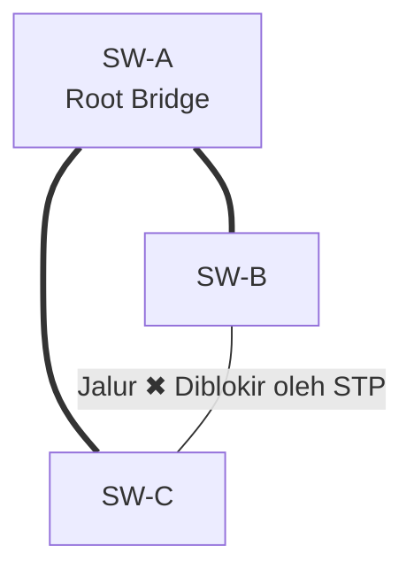

# Switching & VLAN

Kalau [routing](/networking/routing) mengatur perjalanan **antar**-jaringan,
switching mengatur lalu lintas **di dalam** satu jaringan lokal. Switch bekerja
di [layer 2](/networking/model-osi#layer-2-—-data-link), berbicara dalam bahasa
*frame* dan alamat MAC.

## Alamat MAC

Alamat MAC (*Media Access Control*) adalah identitas 48-bit yang tertanam di
setiap kartu jaringan, ditulis heksadesimal:

| Bagian | Contoh Nilai | Penjelasan |
| :--- | :---: | :--- |
| **OUI** *(24 bit)* | `3C:5A:B4` | Mengidentifikasi *vendor* pabrik perangkat (misal: Cisco, Apple) |
| **NIC-specific** *(24 bit)* | `12:34:56` | Nomor seri perangkat yang unik dari pabrik tersebut |

24 bit pertama (OUI) mengidentifikasi vendor; sisanya nomor urut perangkat.
Berbeda dengan IP yang **logis dan hierarkis** (bisa dipindah, menunjukkan
lokasi jaringan), MAC itu **fisik dan datar** — melekat pada perangkat, tidak
menunjukkan lokasi.

`FF:FF:FF:FF:FF:FF` adalah MAC broadcast: frame untuk semua perangkat di
jaringan lokal.

## Bagaimana switch belajar

Switch memegang **MAC address table** (CAM table): pemetaan alamat MAC → port.
Cara kerjanya elegan karena sepenuhnya otomatis:

1. **Learning** — setiap frame yang masuk dibaca **MAC sumbernya**, lalu
   dicatat: "MAC ini ada di port ini".
2. **Forwarding** — MAC **tujuan** dicari di tabel; jika ketemu, frame dikirim
   hanya ke port itu.
3. **Flooding** — jika MAC tujuan belum dikenal (atau broadcast), frame
   dikirim ke **semua** port kecuali port asal.
4. **Aging** — entri yang lama tidak terdengar (default ±300 detik) dihapus.

**Kondisi Awal**: Masuk sebuah frame dari **port 3** dengan `Sumber: AA:..:01` dan `Tujuan: BB:..:02`.

| Alamat MAC | Berada di Port | Status Catatan Switch |
| :--- | :---: | :--- |
| **`AA:..:01`** | **`3`** | *(Baru dicatat dari sumber)* |
| `BB:..:02` | `7` | *(Sudah ada)* → **Keputusan:** Kirim frame hanya ke port 7 |
| `CC:..:03` | `1` | *(Sudah ada di memori)* |

Inilah bedanya dengan **hub** zaman dulu yang membabi buta mengulang sinyal ke
semua port: switch menciptakan jalur privat antar-dua-port, sehingga banyak
percakapan bisa berlangsung serentak tanpa tabrakan.

::: info Analogi: resepsionis yang menghafal
Switch adalah resepsionis gedung yang tidak pernah bertanya, hanya
memperhatikan: setiap kali seseorang keluar dari ruangan tertentu, ia mencatat
"oh, si A duduk di ruang 3". Surat untuk A langsung diantar ke ruang 3. Surat
untuk orang yang belum dikenal? Diumumkan ke seluruh gedung (*flooding*) — dan
begitu orangnya menjawab, ruangannya langsung tercatat. Tidak ada konfigurasi,
tidak ada database pusat; jaringan "terpetakan sendiri".
:::

### Collision domain vs broadcast domain

Dua istilah yang sering tertukar:

- **Collision domain** — wilayah tempat dua sinyal bisa bertabrakan. Setiap
  **port switch** adalah collision domain sendiri (masalah tabrakan praktis
  sudah mati bersama hub).
- **Broadcast domain** — wilayah yang mendengar satu frame broadcast. Seluruh
  switch yang saling tersambung = **satu** broadcast domain, sampai dipecah
  oleh router atau VLAN.

Jadi: switch memecah collision domain; **router dan VLAN memecah broadcast
domain**.

## ARP: jembatan antara IP dan MAC

Komputer berpikir dalam IP, tapi frame butuh MAC. **ARP** (*Address Resolution
Protocol*) menerjemahkannya:

| Langkah | Jenis Pesan | Isi Percakapan | Keterangan |
| :---: | :--- | :--- | :--- |
| **1** | `Broadcast` | "Siapa yang punya `192.168.1.20`? Tolong beri tahu `192.168.1.7`" | Permintaan (*ARP Request*) |
| **2** | `Unicast` | "`192.168.1.20` ada di MAC `BB:CC:DD:11:22:33`" | Balasan (*ARP Reply*) |
| **3** | *Internal* | Disimpan di *ARP Cache* memori PC | Frame siap dibungkus dan dikirimkan |

```bash
ip neigh show          # lihat ARP cache di Linux
# 192.168.1.1 dev wlan0 lladdr a4:91:b1:xx:xx:xx REACHABLE
```

Penting: jika tujuan berada di **subnet lain**, host tidak meng-ARP tujuan —
ia meng-ARP **gateway**-nya, karena frame hanya perlu sampai ke router.

## Broadcast domain dan masalah skala

Semua port di satu switch (dan switch-switch yang tersambung) membentuk satu
**broadcast domain**: satu broadcast ARP didengar semua perangkat. Dengan 500
host di satu domain, setiap komputer terus-menerus diganggu broadcast orang
lain — boros, berisik, dan satu insiden (badai broadcast, perangkat nakal)
menular ke semuanya.

Solusinya: memecah broadcast domain. Bisa dengan router fisik — atau dengan
cara yang jauh lebih luwes: **VLAN**.

## VLAN: banyak jaringan di satu switch

VLAN (*Virtual LAN*) membagi satu switch fisik menjadi beberapa jaringan logis
yang saling terisolasi. Port yang berbeda VLAN tidak bisa saling bicara di
layer 2 — seolah-olah berada di switch yang berbeda.

| ID VLAN | Nama / Peruntukan | Anggota Port |
| :---: | :--- | :---: |
| **`10`** | Karyawan | `1 - 8` |
| **`20`** | Tamu | `9 - 16` |
| **`30`** | CCTV | `17 - 24` |

> *CCTV tidak bisa mengendus trafik karyawan; dan perangkat Tamu terisolasi dari keduanya. Mereka hanya bisa berkomunikasi jika diizinkan oleh Router.*

Manfaatnya: segmentasi keamanan, membatasi broadcast, dan pengelompokan
berdasarkan fungsi tanpa peduli lokasi fisik.

### Trunk dan tagging 802.1Q

Bagaimana VLAN 10 di switch A tersambung ke VLAN 10 di switch B? Lewat **trunk
port** — satu kabel yang membawa banyak VLAN sekaligus. Setiap frame di trunk
diberi **tag 802.1Q**: 4 byte tambahan berisi VLAN ID (1–4094).

```text
Frame biasa : [MAC tujuan|MAC sumber|      Type|data|FCS]
Frame tagged: [MAC tujuan|MAC sumber|802.1Q|Type|data|FCS]
                                      └─ VLAN ID di sini
```

- **Access port** — milik satu VLAN; frame keluar-masuk tanpa tag (untuk
  perangkat akhir).
- **Trunk port** — membawa banyak VLAN; frame diberi tag (untuk antar-switch
  dan ke router).

### Antar-VLAN tetap butuh router

VLAN memisahkan di layer 2; untuk berkomunikasi antar-VLAN, trafik harus naik
ke layer 3. Pola umumnya **router-on-a-stick** (satu trunk ke router dengan
sub-interface per VLAN) atau **switch layer 3** yang bisa merutekan langsung
antar-VLAN di dalam dirinya — pilihan standar jaringan kampus/kantor modern.

## Spanning Tree Protocol (STP)

Demi redundansi, antar-switch sering dihubungkan lebih dari satu jalur. Tapi
loop di layer 2 fatal: frame broadcast tidak punya TTL, sehingga berputar dan
menggandakan diri tanpa henti — **broadcast storm** yang melumpuhkan jaringan
dalam hitungan detik.

**STP (802.1D)** mencegahnya: switch-switch memilih satu *root bridge*, lalu
memblokir port-port yang membentuk loop, menyisakan topologi pohon (bebas
loop). Saat jalur aktif putus, port cadangan dibuka otomatis. Varian modern
**RSTP** (802.1w) konvergen dalam ±1–2 detik.


*STP memilih SW-A sebagai root, lalu memblokir salah satu sisi segitiga (port menuju SW-C). Kabel tersebut tetap terpasang secara fisik, berstatus "siaga" menggantikan jika jalur utama putus.*

Pelajaran praktisnya dua arah: **(1)** jangan takut memasang kabel redundan —
STP yang mengurus; **(2)** jangan pernah mematikan STP "biar cepat", karena
satu kabel yang tak sengaja melingkar (dua ujung dicolok ke switch yang sama!)
bisa melumpuhkan seluruh gedung.

::: tip Ringkasan mental: switch vs router
- Switch: "MAC ini di port mana?" — cepat, satu gedung, plug-and-play.
- Router: "prefix IP ini lewat mana?" — antar-jaringan, kenal dunia luar.
- VLAN: switch fisik dipotong jadi beberapa switch logis; router (atau switch
  L3) menjembatani antar-potongan.
:::

## Di jaringan berbasis satelit

Terminal [VSAT](/satelit/vsat) di lokasi terpencil biasanya menjadi ujung
trunk: di belakang modem satelit ada switch kecil dengan VLAN terpisah untuk
data operasional, telepon (VoIP), dan Wi-Fi publik — tiga layanan berbagi satu
transponder yang sama dengan prioritas QoS berbeda. Semua konsep di halaman
ini bekerja persis sama; satelit hanya mengganti "kabel antar-gedung" dengan
lompatan 36.000 km.

## Cek pemahaman

1. Frame tiba dengan MAC tujuan yang tidak ada di tabel switch. Apa yang
   terjadi? <br>→ **Flooding** — dikirim ke semua port kecuali port asal;
   begitu tujuan membalas, MAC-nya langsung dipelajari.
2. Dua PC di VLAN 10 dan VLAN 20 pada switch yang sama saling `ping` — gagal.
   Normal? <br>→ **Normal.** VLAN memisahkan di layer 2; antar-VLAN harus
   lewat router / switch L3.
3. Laptop mau mengirim ke server di subnet lain. Laptop meng-ARP alamat siapa?
   <br>→ **Gateway**-nya, bukan server tujuan — frame hanya perlu sampai ke
   router.
4. Kabel antar-switch dicabut dan trafik VLAN 30 antar-gedung mati, padahal
   VLAN 10 masih hidup lewat kabel lain. Dugaan? <br>→ Kabel yang tercabut
   adalah **trunk** yang membawa VLAN 30, sedangkan kabel satunya tidak
   mengizinkan VLAN 30 — periksa daftar VLAN di konfigurasi trunk.

**Praktik:** bangun bridge, access port, dan trunk 802.1Q dari halaman ini di
[Bridging & Switching (MikroTik)](/mikrotik/bridging-switching).

Berikutnya: nama-nama protokol yang sejak tadi berseliweran — TCP, UDP, DNS,
DHCP, HTTP — dibedah satu per satu di [Protokol Jaringan](/networking/protokol).
