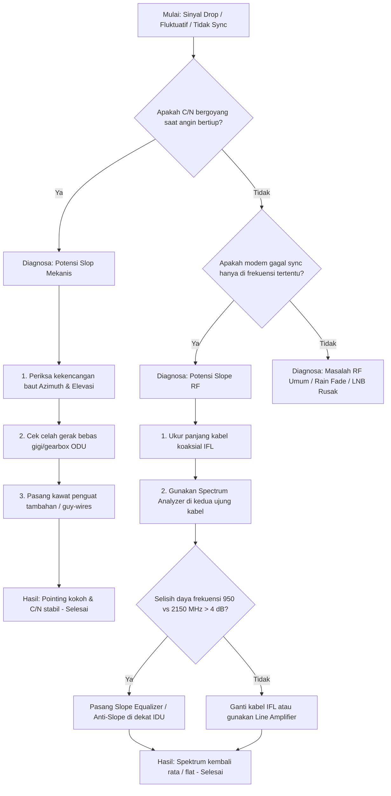

# VSAT — Operasional & Perencanaan

Setelah memahami [teori VSAT](/satelit/vsat) — topologi, MF-TDMA, PEP — tibalah
praktik nyata: bagaimana merencanakan, memasang, mengoperasikan, dan
memecahkan masalah jaringan VSAT.

Halaman ini membahas sisi operasional yang jarang ditulis di buku teori tapi
dihadapi setiap hari oleh teknisi dan network engineer di Indonesia.

## SCPC: dedicated carrier

Selain [MF-TDMA](/satelit/vsat#mf-tdma-berbagi-transponder), ada mode
**SCPC** (*Single Channel Per Carrier*) — satu carrier frekuensi dialokasikan
secara permanen ke satu koneksi.

### Cara kerja

```
Remote A ──▶ 14.025 GHz (dedicated) ──▶ Transponder ──▶ Hub
Remote B ──▶ 14.050 GHz (dedicated) ──▶ Transponder ──▶ Hub
```

Berbeda dengan TDMA yang bergiliran dalam slot waktu, setiap remote SCPC
memiliki frekuensi sendiri yang selalu aktif — seperti jalur pribadi di
jalan tol.

| Aspek | SCPC | MF-TDMA |
|-------|------|---------|
| **Alokasi** | Carrier dedicated per remote | Carrier dibagi dinamis |
| **CIR** | 100% setiap saat | Statistik (CIR + contention) |
| **Latensi** | Lebih rendah (tanpa *request-slot*) | Ada overhead permintaan slot |
| **Efisien transponder** | Rendah (carrier tetap aktif walau idle) | Tinggi (kapasitas dibagi) |
| **Cocok untuk** | Trunking antarpulau, backhaul seluler, koneksi korporat SLA tinggi | ATM, retail, internet konsumen, remote banyak |
| **Biaya per remote** | Lebih mahal | Lebih murah per remote |

### Praktik SCPC di Indonesia

- **Backhaul BTS** di Papua dan Maluku — operator seluler menyewa carrier
  SCPC 2–10 Mbps per BTS sebagai pengganti fiber.
- **Trunking antarpulau** (telepon, korporat) — menggantikan kabel laut yang
  belum ada.
- **Link dedicated pemerintah** — Puskesmas, kantor kecamatan, kodim.

Konfigurasi SCPC bersifat tetap — sekali *line-up* (frekuensi, symbol rate,
FEC, modulasi), carrier hidup 24/7. Perubahan butuh koordinasi dengan NOC
hub.

## SCPC vs TDMA: kapan pakai yang mana?

Keputusan bukan "mana lebih baik" tapi **"mana yang cocok untuk kebutuhan
ini"**:

| Jika kebutuhanmu... | Pakai... | Alasan |
|---------------------|----------|--------|
| 5–50 remote dengan traffic stabil | **SCPC** | Biaya transponder lebih murah dari TDMA untuk sedikit remote |
| 500–5.000 remote dengan traffic bursty | **MF-TDMA** | Efisiensi transponder jauh lebih tinggi |
| SLA 99,95%+ dengan CIR terjamin | **SCPC** | Tidak ada *oversubscription* |
| Budget terbatas, banyak lokasi | **MF-TDMA** | Berbagi kapasitas menekan biaya per titik |
| Backhaul seluler antarpulau | **SCPC** | Kebutuhan bandwidth stabil dan besar |
| ATM/EDC ritel | **MF-TDMA** | Transaksi kecil, tidak terus-menerus |

Di Indonesia, keduanya dipakai berdampingan — operator besar seperti Telkom
dan BAKTI menggunakan SCPC untuk *feeder* dan MF-TDMA untuk akses.

## Perencanaan bandwidth VSAT

Merencanakan kapasitas VSAT bukan "beli 10 Mbps" — ada tiga lapisan yang
harus dihitung.

### 1. CIR agregat

Hitung kebutuhan tiap remote lalu jumlahkan:

| Jenis remote | Jumlah | CIR per remote | Total CIR |
| --- | --- | --- | --- |
| ATM/EDC | 300 | 128 Kbps | 38,4 Mbps |
| Kantor cabang | 50 | 2 Mbps | 100 Mbps |
| Puskesmas (data ringan) | 100 | 256 Kbps | 25,6 Mbps |
| VoIP | 50 | 128 Kbps | 6,4 Mbps |
| **Total CIR dibutuhkan** | | | **±170,4 Mbps** |

### 2. Oversubscription

Transponder tidak perlu total CIR = total bandwidth. Gunakan rasio
*contention* yang sesuai:

| Tipe traffic | Contention wajar | Arti |
|-------------|------------------|------|
| ATM / transaksi | 1:1 | Setiap remote dapat CIR penuh kapan saja |
| Kantor cabang aktif | 1:2 s.d. 1:4 | Rata-rata tidak semua remote kirim penuh bersamaan |
| Internet konsumen / desa | 1:10 s.d. 1:50 | Trafik browsing sangat bursty |

| Perhitungan | Nilai |
| --- | --- |
| Total CIR dibutuhkan | 170,4 Mbps |
| Rata-rata contention | 1:3 (kantor + puskesmas + ATM campur) |
| **Bandwidth transponder perlu** | **170,4 ÷ 3 ≈ 57 Mbps** |

### 3. Overhead transponder

Bandwidth digital ≠ bandwidth RF. Hitung overhead:

- **Modulasi**: 8PSK 3/4 = 1,5× bitrate payload untuk bitrate simbol.
- **Roll-off**: DVB-S2 roll-off 5–20% (5% di S2X).
- **Guard band**: antar-carrier ambil ±10%.
- **ACMs margin**: untuk rain fade, sisihkan 2–3 dB = ~2× daya saat hujan.

**Contoh kasar**: untuk payload 10 Mbps dengan 8PSK 3/4 + roll-off 20%:
`10 × 1,5 (modulasi) × 1,2 (roll-off) = 18 MHz` bandwidth transponder.

### 4. Memilih ukuran transponder

Transponder HTS tipikal 36–54 MHz per *beam*. Satu beam bisa menampung
beberapa carrier. Dari hitungan di atas:

| Langkah | Hasil |
| --- | --- |
| Payload | 57 Mbps |
| Dengan DVB-S2 8PSK ¾ (×1,5) + roll-off (×1,2) | 57 × 1,5 × 1,2 ≈ **103 MHz** |
| Kebutuhan transponder | ±2–3 transponder 36 MHz, atau ±1 transponder 72 MHz |
| Pembagian carrier | Beberapa carrier SCPC (kantor) + satu pool MF-TDMA (ATM/puskesmas) |

## Link budget praktis

[Teori link budget](/satelit/komunikasi#link-budget-akuntansi-desibel) sudah
dibahas. Di sini pendekatan spreadsheet untuk perencanaan nyata.

### Template minimum

| Parameter | Nilai | Satuan | Sumber |
|-----------|-------|--------|--------|
| Frekuensi downlink | 12.000 | MHz | Spesifikasi satelit / operator |
| Jarak (GEO) | 37.800 | km | Dari posisi bumi ke satelit |
| FSPL | 206 | dB | `20×log10(d) + 20×log10(f) + 92,45` |
| EIRP satelit | 52 | dBW | Spesifikasi satelit per beam |
| Rx gain antena (1,2 m) | 37 | dBi | `10×log10(η × (πD/λ)²)` — lihat katalog atau kalkulator |
| Gain LNB | 60 | dB | Spesifikasi LNB (tipikal) |
| Noise figure LNB | 0,7 | dB | Spesifikasi LNB |
| G/T sistem | 18 | dB/K | `G_antena - 10×log10(T_antena + T_LNB)` |
| C/N0 | 85 | dB-Hz | `EIRP - FSPL + G/T - k` (k = -228,6 dBW/Hz/K) |
| C/N | 12 | dB | `C/N0 - 10×log10(BW)` — BW = symbol rate × (1+roll-off) |
| Threshold modulasi | 8 | dB | C/N minimum untuk QPSK 3/4 (DVB-S2) |
| **Rain fade** (Ku, 99,5%) | 3 | dB | Dari ITU-R P.618 untuk lokasi tropis |
| **Link margin** | 1 | dB | `C/N - threshold - rain fade` — HARUS positif |

**Aturan praktis**: link margin minimal 3 dB (termasuk rain fade) untuk
layanan yang andal. Margin < 0 dB = sering putus saat hujan.

### Menghitung ukuran antena

Jika link budget kurang, opsi termudah: **perbesar antena**. Setiap dua kali
lipat diameter → +6 dB gain.

| Diameter antena | Gain (Ku-band) |
| --- | --- |
| 0,9 m | 35 dBi |
| 1,2 m | 37 dBi |
| 1,8 m | 41 dBi |
| 2,4 m | 44 dBi |

Dari 0,9 m ke 1,8 m = +6 dB = bisa tembus hujan 2× lebih deras.

## Instalasi VSAT — SOP langkah demi langkah

### Sebelum berangkat

- [ ] Konfirmasi koordinat lokasi (GPS). Jangan percaya Google Maps saja —
      ukur langsung di titik antenan.
- [ ] Cek *azimuth* dan *elevasi* target dari koordinat (alat: SatCalc app,
      DishPointer, atau spreadsheet).
- [ ] Cek *polarisasi*: H/V atau RHCP/LHCP — tanya NOC.
- [ ] Bawa: kabel IFL (ukur + cadangan 3 m), konektor F/N-type + crimp tool,
      multimeter, kompas, inclinometer, spidol, laptop + kabel serial/ETH
      untuk modem.
- [ ] Cek cuaca — jangan pasang saat hujan (berbahaya) atau angin kencang
      (sulit pointing).

### Langkah pemasangan

**1. Pondasi & bracket**

Antena 0,9–1,2 m cukup *wall mount* atau tiang Ø2–3". Antena 1,8+ m butuh
pondasi beton. Pastikan:
- Tiang **tegak lurus** (spirit level) — jika tiang miring, elivasi akan
  meleset.
- Tidak ada penghalang (pohon, bangunan) di jalur satelit — cek dengan
  aplikasi kompas + kamera AR (DishPointer).

**2. Rakit antena**

Ikuti manual — beberapa model butuh perakitan reflektor, feed, dan bracket.
Pemasangan feed: centering dan focal length harus presisi. Pabrikan memberi
pedoman jarak feed ke reflektor.

**3. Pasang BUC & LNB**

- BUC: biasanya dipasang di feed, terhadap dengan kabel F/IFL.
- LNB: dipasang di feed arm, terhadap dengan kabel IFL lain (atau
  *single coax* untuk model *transceiver* dengan bias-T).
- Beri *self-amalgamating tape* di konektor untuk anti-air.
- BUC butuh kabel DC + 10 MHz reference dari IDU — pastikan kabel IFL
  cukup tebal (RG-6/RG-11 untuk jarak > 30 m).

**4. IFL ke IDU**

- Kabel koaksial dari ODU ke modem di dalam ruangan.
- Jarak maksimal: 50–100 m (tergantung redaman kabel). Di atas itu butuh
  *line amplifier*.
- Konektor F/N-type harus rapi — konektor jelek = interferensi + loss.

**5. Hubungkan IDU & konfigurasi awal**

- Modem VSAT → RouterOS → LAN.
- Set parameter di modem: frekuensi, symbol rate, FEC, modulasi (dari NOC).
- Modem akan mulai ***receive sync*** — lampu RX berkedip lalu hijau stabil.
- Jika tidak: cek kabel IFL, polarisasi LNB, atau daya LNB di modem.

**6. Pointing**

Ini langkah paling kritis:

1. Atur elevasi antena ke sudut target (gunakan inclinometer).
2. Atur azimuth ke kiri/kanan target ±5°.
3. Pantau level sinyal di modem (Rx level / C/N).
4. Gerakkan azimuth perlahan sambil amati level sinyal — cari puncak.
5. Ulangi untuk elevasi: naik/turun 1–2°.
6. Cross-check: antena di puncak level sinyal = azimuth dan elevasi optimal.
7. Kencangkan baut — sinyal bisa turun sedikit, koreksi ulang.

Rule of thumb: **Rx level > -70 dBm** untuk Ku-band; C/N > 12 dB untuk
QPSK.

**7. Cross-pol & line-up**

Setelah pointing sempurna, hubungi NOC untuk **line-up**:

- Remote diminta memancar (*TX on*).
- NOC mengukur polarisasi: jika cross-pol > 30 dB (terima polarisasi lawan
  minimal 30 dB di bawah polarisasi utama) — OK.
- Jika cross-pol jelek: putar feed di leher ODU ±5°.
- NOC mengonfirmasi level TX sudah sesuai.

**8. Komisioning**

Modem mengunduh konfigurasi dari hub (parameter MF-TDMA, QoS, PEP —
tidak perlu diset manual). Cek:
- IP WAN dari hub tercapai.
- Ping ke hub < 700 ms (GEO).
- Traffic shaping bekerja (speedtest sesuai CIR/MIR).
- LAN di belakang RouterOS berfungsi normal.

## Troubleshooting VSAT

### Matriks gejala — penyebab — solusi

### RX (penerimaan) bermasalah

| Gejala | Kemungkinan | Cek | Solusi |
|--------|------------|-----|--------|
| Rx level sangat rendah (> -80 dBm Ku) | Pointing meleset | Level sinyal di modem | Arahkan ulang antena |
| Rx level hilang total | Kabel IFL putus / konektor basah | Kontinuitas kabel, konektor | Ganti atau keringkan |
| Rx sync tidak dapat | Frekuensi/SR salah | Parameter dari NOC | Set ulang parameter modem |
| C/N rendah (< 8 dB) | Hujan deras | Cek cuaca | Tunggu reda, atau perbesar antena (permanen) |
| C/N rendah (cerah) | Interferensi / pointing | Spectrum analyzer | Cari interferensi, perbaiki pointing |

### TX (pemancaran) bermasalah

| Gejala | Kemungkinan | Cek | Solusi |
|--------|------------|-----|--------|
| TX alarm (tidak bisa pancar) | BUC tidak dapat DC | Cek catu daya BUC di IDU | Ganti IDU atau catu daya eksternal |
| TX power terlalu rendah | BUC rusak / kabel panjang | Ganti BUC jika perlu | Ganti BUC |
| TX power terlalu tinggi | Konfigurasi salah | *Attenuation* di modem | Naikkan *attenuation* |
| Cross-pol gagal saat line-up | Polarisasi feed salah | Putar feed | Koreksi polarisasi |
| Modem TX on tapi hub tidak terima | Frekuensi TX salah | Cek TX freq dari NOC | Set ulang frekuensi |
| "CW carrier" — BUC pancar terus tanpa data | Modem tidak mengirim data ke BUC | Kabel IF antara modem-BUC | Restart modem, cek kabel, ganti modem |

### Modem & konektivitas

| Gejala | Kemungkinan | Cek | Solusi |
|--------|------------|-----|--------|
| Modem sync RX ✅ tapi tidak dapat IP | DHCP hub gagal | Konfigurasi modem | Restart modem, kontak NOC |
| Ping ke hub loss 50%+ | RF interferensi, rain fade, atau C/N rendah | C/N dan Es/N0 di modem | Jika cerah: cari interferensi. Jika hujan: terima |
| Latensi > 700 ms | Ada masalah (GEO maks 600 ms) | RTT ke hub | Indikasi double-hop atau buffering berlebih |
| Throughput di bawah CIR | PEP tidak aktif, atau QoS salah | Tes throughput dengan FTP/langsung | Kontak NOC untuk settingan PEP |
| Modem restart sendiri | Overheat / power supply | Suhu sekitar, kestabilan listrik | Tambah ventilasi, UPS |
| Lampu sync mati berkala | Kabel longgar / konektor basah | Periksa konektor outdoor | Bungkus ulang dengan *weatherproofing* tape |

### Prosedur restart yang benar

1. **Jangan restart BUC** secara langsung — bisa merusak.
2. Turunkan TX dari menu modem (TX mute).
3. Restart modem — tunggu RX sync.
4. Hidupkan TX — hub akan beri izin.
5. Jika tetap tidak bisa: restart dari hub (kontak NOC).

### Alat troubleshooting wajib

| Alat | Untuk apa |
|------|-----------|
| **Multimeter** | Cek kontinuitas kabel, tegangan DC BUC/LNB (13/18V DC) |
| **SatFinder / spectrum analyzer** | Pointing cepat, lihat interferensi |
| **Laptop + aplikasi modem** | Baca log, statistik RF, set parameter |
| **GPS / kompas** | Koordinat, azimuth |
| **Inclinometer / busur digital** | Elevasi presisi |
| **Self-amalgamating tape** | Waterproof konektor outdoor |
| **Kabel + connector cadangan** | Kerusakan mekanis saat instalasi |

## Troubleshooting Khusus: Slop Mekanis & Slope RF (Anti-Slop & Anti-Slope)

Dalam operasional jaringan satelit/VSAT di lapangan, teknisi sering kali menjumpai penurunan performa sinyal atau kegagalan sinkronisasi yang disebabkan oleh dua fenomena degradasi fisik yang memiliki nama serupa namun bekerja pada ranah yang berbeda: **Slop Mekanis (Mekanik Antena)** dan **Slope RF (Frekuensi Sinyal)**.

Berikut adalah penjelasan mendalam tentang penyebab, dampak, dan prosedur troubleshooting untuk mengatasi keduanya (*Anti-Slop* dan *Anti-Slope*).

---

### 1. Slop Mekanis (Mechanical Backlash / Play)

**Slop Mekanis** adalah adanya celah kelonggaran, ruang main, atau *backlash* pada komponen fisik penyangga (mount) atau roda gigi penggerak antena VSAT. 

```
[Beban Angin / Getaran]
      │
      ▼
   [Reflektor] ──(slop mekanik/celah gear)──▶ Sudut Pointing Bergeser (±0.2° s.d ±1°)
                                                   │
                                                   ▼
                                         Sinyal Drop / Off Target
```

#### A. Mengapa Slop Mekanis Terjadi?
* **Keausan Gigi Gearbox:** Pada sistem antena bermotor (seperti *Auto-Pointing* atau *tracking antenna* pada kapal maritim), gesekan terus-menerus mengikis gigi-gigi penggerak sehingga timbul celah.
* **Kelonggaran Baut Pengunci:** Angin kencang (*wind load*) yang menerpa piringan antena secara berulang akan menyebarkan getaran mikro yang melonggarkan baut azimuth dan elevasi.
* **Deformasi Pondasi / Tiang:** Tiang penyangga yang tidak kokoh atau pondasi beton yang retak/mengalami penurunan tanah menciptakan pergeseran mekanis.
* **Desain Mekanik Murahan:** Bracket non-presisi yang memiliki toleransi longgar sejak dari pabrik.

#### B. Dampak Terhadap Jaringan
* **C/N Fluktuatif (Goyang):** Sinyal naik-turun seiring hembusan angin. Saat angin tenang sinyal bagus (misal C/N 13 dB), namun saat diterpa angin sinyal anjlok (misal C/N 7 dB atau putus).
* **Modem Sering Hunting:** Pada VSAT bergerak (*Communication On The Move* / COTM), adanya *slop* membuat sistem servo berputar melebihi target (*overshoot*), sehingga antena terus-menerus "berburu" sinyal tanpa henti yang mempercepat kerusakan motor penggerak.
* **Kegagalan Cross-Pol:** Sedikit saja antena berputar pada poros feed-nya akibat *slop*, isolasi polarisasi (*cross-pol*) akan gagal, mengganggu transponder satelit lain.

#### C. Solusi & Mitigasi (Anti-Slop)

| Metode | Cara Kerja & Penerapan |
|---|---|
| **Mechanical Anti-Backlash** | Menggunakan sistem roda gigi ganda (*Split-Gear*) dengan pegas pendorong, atau motor penggerak ganda (*Drive-Anti-Drive* / torque biasing) di mana satu motor menggerakkan dan motor kedua memberi torsi penahan untuk mengeliminasi celah bebas antar gigi. |
| **Preventive Maintenance Fisik** | - Menggunakan kunci torsi untuk memastikan baut pengunci azimuth dan elevasi dikencangkan sesuai spesifikasi pabrikan.<br>- Memasang tali labrang (*guy-wire*) baja tambahan pada tiang penyangga untuk meredam goyangan akibat beban angin.<br>- Memakai *Locking Washer* (ring per/gigi) agar baut tidak mudah kendor akibat getaran. |
| **Software Backlash Compensation** | Pada *Antenna Control Unit* (ACU) modern, nilai celah mekanis diukur (dalam miliderajat) dan dimasukkan ke dalam algoritma kontrol. Ketika antena berbalik arah, ACU secara otomatis menambahkan langkah kompensasi ekstra untuk melewati celah kosong sebelum melakukan penyesuaian pointing nyata. |
| **One-Sided Positioning** | Memprogram ACU agar selalu mendekati koordinat target dari satu arah yang konsisten (misalnya selalu dari arah timur ke barat). Hal ini memaksa semua kelonggaran/celah mekanis tertinggal di satu sisi, menjaga kestabilan posisi akhir. |

---

### 2. Slope RF (Frequency Attenuation Slant)

Berbeda dengan slop mekanik, **Slope RF** adalah deviasi atau ketidakrataan respons frekuensi di mana sinyal mengalami penurunan gain (redaman) secara bertahap seiring dengan meningkatnya frekuensi kerja di sepanjang kabel koaksial IFL (*Inter-Facility Link*).

```
Level Sinyal (dB)
  ▲
  │   [Respons Frekuensi Rata / Flat]
  │  ────────────────────────────────────── (Tanpa Redaman Kabel Panjang)
  │
  │  ──＼
  │      ＼
  │        ＼  [Slope RF / Redaman Miring] (Sinyal frekuensi tinggi teredam lebih parah)
  │          ──＼
  ─┴──────────────────────────────────────▶ Frekuensi L-Band (MHz)
     950 MHz                           2150 MHz
```

#### A. Mengapa Slope RF Terjadi?
Sinyal IF (Intermediate Frequency) antara modem (IDU) dan ODU ditransmisikan menggunakan kabel koaksial (biasanya L-Band: 950–2150 MHz). Berdasarkan hukum fisika RF, redaman kabel koaksial berbanding lurus dengan frekuensi.
* Pada kabel RG-6 sepanjang 50 meter:
  * Redaman pada frekuensi **950 MHz** adalah sekitar **10 dB**.
  * Redaman pada frekuensi **2150 MHz** naik menjadi sekitar **16 dB**.
* Hal ini menciptakan selisih redaman (**slope**) sebesar **6 dB** antara ujung bawah dan ujung atas pita frekuensi. Jika panjang kabel melebihi 50 meter, slope ini akan semakin curam.

#### B. Dampak Terhadap Jaringan
* **Kegagalan Sync Frekuensi Atas:** Jika operator mengalokasikan carrier frekuensi Anda di ujung atas L-Band (misalnya 2000 MHz), modem mungkin tidak dapat melakukan *lock/sync* karena sinyal teredam terlalu parah di bawah ambang batas penerimaan.
* **Distorsi Intermodulasi:** Ketidakseimbangan level sinyal di sepanjang spektrum memaksa BUC atau LNA bekerja pada rentang non-linear, menghasilkan harmonisa pengganggu.
* **Penurunan Eb/No:** Rasio energi per bit terhadap derau (*Eb/No*) menurun drastis pada frekuensi tinggi, meningkatkan *Bit Error Rate* (BER).

#### C. Solusi & Mitigasi (Anti-Slope)

* **Slope Equalizer (Equalizer Slope / Anti-Slope Device):**
  Alat pasif RF yang dirancang memiliki karakteristik redaman yang **berbanding terbalik** dengan kabel koaksial (redaman tinggi pada frekuensi rendah, redaman rendah pada frekuensi tinggi). Pemasangan *Slope Equalizer* secara seri dengan kabel akan mengompensasi kemiringan tersebut sehingga respons total kembali rata (*flat*).
* **Slope-Compensated Line Amplifier:**
  Jika kabel terlalu panjang dan sinyal drop secara keseluruhan, gunakan penguat kabel (*line amplifier*) yang dilengkapi fitur equalizer kemiringan (tilt/slope adjustment) terintegrasi.
* **Upgrade Jenis Kabel:**
  Mengganti kabel RG-6 standar dengan kabel berkualitas lebih tinggi seperti RG-11 (memiliki redaman lebih rendah) atau menggunakan kabel *coaxial low-loss corrugated* (seperti Heliax LDF4-50) untuk instalasi jarak menengah (50–100 meter).
* **L-Band Fiber Optic Link:**
  Untuk jarak antara ODU dan IDU yang sangat jauh (lebih dari 100 meter), redaman kabel koaksial terlalu besar untuk dikompensasi. Solusi terbaik adalah menggunakan transceiver optik L-band yang mengonversi sinyal RF menjadi cahaya, mengeliminasi redaman frekuensi (*slope*) secara total hingga jarak beberapa kilometer.

---

### 3. SOP Diagnostik & Troubleshooting di Lapangan

Ikuti diagram alur diagnostik berikut ketika mendeteksi masalah fluktuasi sinyal atau ketidakmampuan sinkronisasi frekuensi:



#### Langkah-Langkah Penanganan Cepat di Lapangan:

1. **Uji Fisik "Goyang Antena":**
   Pegang tepian reflektor VSAT dengan tangan lalu dorong perlahan ke atas/bawah dan kiri/kanan. Jika reflektor dapat bergerak bebas lebih dari **2 milimeter** tanpa memutar baut penyangga, dipastikan terdapat **slop mekanis** yang harus dieliminasi dengan mengencangkan baut penahan atau mengganti bracket yang aus.
2. **Pemeriksaan Tegangan Cable Slope (IFL Test):**
   * Lepaskan konektor IFL dari LNB di outdoor.
   * Gunakan multimeter untuk mengukur tegangan DC yang dikirim dari modem (IDU) di ujung kabel outdoor. Pastikan tegangan berada di kisaran **13V DC** (polarisasi vertikal/RHCP) atau **18V DC** (polarisasi horizontal/LHCP) tanpa penurunan tegangan (*voltage drop*) yang signifikan. Penurunan tegangan menandakan resistansi kabel terlalu tinggi (kabel lapuk/basah) yang memperparah *slope RF*.
3. **Penyelarasan Kemiringan (Slope Tuning):**
   Jika menggunakan *Variable Slope Equalizer*, putar sekrup penyetel (*tilt/slope screw*) sambil mengamati spektrum frekuensi pada modem atau *spectrum analyzer* hingga perbedaan level daya (*power delta*) antara frekuensi terendah dan tertinggi mendekati **0 dB (flat)**.

---

## Arsitektur hub & NMS

### Komponen hub

Hub adalah "otak" jaringan VSAT. Ia jauh lebih kompleks dari remote:

```text
Antena besar (7–13 m)
    │
    ├── HPA (High Power Amplifier) — 100–500W
    ├── LNB/LNA dengan redundancy
    │
    Modem Hub — menerima banyak carrier inbound
    │
    ├── BMS (Bandwidth Management System) — alokasi TDMA, QoS, CIR/MIR
    ├── PEP Server — akselerasi TCP
    ├── NMS (Network Management System) — monitoring + konfigurasi
    ├── DHCP / DNS server
    │
    └── Router — koneksi ke internet / WAN korporat
```

### Redundancy

Hub adalah *single point of failure* untuk ratusan–ribuan remote:

- **Redundant HPA**: satu aktif, satu *standby hot*. Beralih otomatis jika
  gagal.
- **Dual modem/FPGA**: keping modem utama + cadangan.
- **UPS + generator**: hub harus hidup saat pemadaman.
- **Diverse fiber**: dua jalur internet dari ISP berbeda.
- **NOC 24/7**: operator memonitor setiap alarm.

### NMS — Network Management System

NMS memonitor:
- Status RF setiap remote: Rx level, C/N, TX power, cross-pol.
- Status layanan: CIR real-time, throughput, packet loss.
- Alarm: remote hilang, C/N rendah, TX alarm.
- Inventaris: konfigurasi, firmware, riwayat gangguan.

Di Indonesia, operator VSAT besar menggunakan NMS berbasis:
- **iDirect NMS / iVantage** (untuk iDirect)
- **Hughes JUPITER Gateway** (Hughes)
- **Gilat NMS** (Gilat)
- **Comtech Heights Gateway** (Comtech)

### Bandwidth Management System (BMS)

BMS adalah "trafik polisi" jaringan VSAT:

- Membagi kapasitas transponder antar remote secara real-time.
- Menegakkan CIR untuk yang berbayar.
- Memberi prioritas: VoIP > ATM > browsing > download.
- Menolak remote yang melampaui MIR.
- Mencatat pemakaian untuk billing.

## Platform VSAT di Indonesia

Empat pabrikan mendominasi:

### iDirect (sekarang ST Engineering iDirect)

Platform terbanyak di Indonesia — SATRIA-1 memakainya.

- **Evolusi**: iDX 3.x → 5.x → 7.x → 9.x.
- **Teknologi**: MF-TDMA + SCPC dalam satu platform.
- **Modem**: 7000, 8500, 9000 series.
- **Kelebihan**: adaptive TDMA, QoS granular, PEP canggih.
- **Kekurangan**: biaya lisensi hub tinggi, konfigurasi kompleks.

### Comtech (EF Data)

Spesialis SCPC — sangat umum untuk backhaul seluler dan trunking.

- **Produk**: CDM-625, CDM-760, CDM-840.
- **Teknologi**: SCPC, DoubleTalk Carrier-in-Carrier (CnC) — dua carrier
  berbagi frekuensi yang sama, menghemat bandwidth hingga 50%.
- **Kelebihan**: SCPC murni sangat stabil, CnC efisien.
- **Kekurangan**: tidak native MF-TDMA (butuh platform terpisah).

### Hughes Network Systems

Pemain global VSAT, populer untuk broadband konsumen dan korporat.

- **Produk**: JUPITER System, HN/HX series.
- **Teknologi**: DVB-S2X forward + TDMA return.
- **Kelebihan**: efisien untuk jumlah remote besar, manajemen trafik bagus.
- **Kekurangan**: ekosistem tertutup — semua harus Hughes.

### Gilat Satellite Networks

Penguasa pasar militer dan pemerintahan.

- **Produk**: SkyEdge II-c, Capricorn, Gemini.
- **Teknologi**: DVB-S2X + SCPC + TDMA hybrid.
- **Kelebihan**: sangat andal, bisa SCPC dan TDMA di platform sama.
- **Kekurangan**: pangsa pasar lebih kecil di Indonesia, SDM langka.

### Memilih platform

| Prioritas | Pilih |
|-----------|-------|
| Harga per terminal murah, jumlah besar | **iDirect** atau **Hughes** |
| Stabilitas SCPC untuk trunking | **Comtech** |
| Fleksibilitas (SCPC + TDMA hybrid) | **Gilat** |
| Ekosistem karosian / militer | **Gilat** atau **Hughes** |
| Dukungan teknisi di daerah | **iDirect** (paling banyak teknisi di Indonesia) |

## Mobile satellite services

Tidak semua satelit stasioner di GEO. Untuk pengguna yang bergerak:

### Inmarsat (GEO)

- **Jaringan**: 4 satelit GEO (I-4, I-5, I-6), jangkauan global
  (kecuali kutub).
- **Layanan**: FleetBroadband (maritim), Global Xpress (ka/K, 50 Mbps),
  BGAN (portabel, 492 Kbps).
- **Penggunaan di Indonesia**: kapal nelayan besar, pesawat, migas lepas
  pantai.
- **Kelebihan**: jangkauan global, perangkat portabel.
- **Kekurangan**: mahal (per MB), bandwidth terbatas.

### Iridium (LEO + crosslink)

- **Jaringan**: 66 satelit LEO + 66 cadangan — dengan ISL laser antar-satelit.
- **Layanan**: Iridium Certus (hingga 700 Kbps), Iridium PTT (push-to-talk),
  Iridium SOS.
- **Penggunaan di Indonesia**: kapal kecil, pendaki gunung, ekspedisi,
  IoT satelit, militer.
- **Kelebihan**: coverage kutub, perangkat kecil, harga langganan relatif
  lebih murah dari Inmarsat.
- **Kekurangan**: kecepatan rendah (700 Kbps di Certus, 2,4 Kbps di RTT
  voice).

### Thuraya (GEO regional)

- **Jangkauan**: Eropa + Afrika + Timur Tengah + Asia (termasuk Indonesia).
- **Layanan**: Thuraya XT (satphone), Thuraya IP (portabel data hingga
  444 Kbps).
- **Penggunaan**: satphone umum di kapal dan tim lapangan Indonesia.
- **Kelebihan**: perangkat murah, banyak beredar di Indonesia.
- **Kekurangan**: data lambat, bukan untuk koneksi permanent.

### Starlink (LEO)

- **Operator**: SpaceX — ±7.000 satelit LEO (dan terus bertambah).
- **Layanan**: Starlink (konsumen 50–220 Mbps), Starlink Business (hingga
  500 Mbps), Starlink Maritime, Starlink Aviation.
- **Di Indonesia**: resmi masuk 2023, lisensi ISP. Cakupan masih parsial
  (stasiun bumi gateway di Jawa dan beberapa kota besar).
- **Kelebihan**: latensi rendah (20–40 ms), kecepatan tinggi, setup mudah.
- **Kekurangan**: harga perangkat ($650 + ongkir), belum kontrak SLA,
  tergantung gateway lokal; jika gateway kelebihan beban atau terputus,
  koneksi turun. Hujan deras juga bisa mengganggu karena Ka-band.

## SATRIA-1: studi kasus Indonesia

### Fakta dasar

| Parameter | Nilai |
|-----------|-------|
| Operator | BAKTI Kominfo |
| Satelit | SATRIA-1 (Satelit Republik Indonesia) |
| Orbit | 146° BT, GEO |
| Kapasitas | 150 Gbps (HTS, Ka-band) |
| Jumlah spot beam | 146 spot (114 di Indonesia, 32 regional) |
| Target titik layanan | ±150.000 (puskesmas, sekolah, kantor pemda) |
| Platform remote | iDirect (ST Engineering) |
| Kontraktor | Thales Alenia Space + konsorsium |

### Arsitektur

```
Gateway (11 stasiun bumi nasional)
    │ (fiber)
    ├── NOC BAKTI + NMS
    │
    └── SATRIA-1 GEO 146° BT
            │
            ├── Spot beam [A1] → Sumatera Utara
            ├── Spot beam [B3] → Kalimantan Tengah
            ├── Spot beam [D2] → Papua
            └── ... 143 spot beam lainnya
                    │
                    ▼
            Remote VSAT (0,9–1,8 m)
                └── RouterOS → LAN
```

### Apa artinya bagi network engineer

SATRIA-1 adalah **HTS Ka-band** — artinya:

- **Throughput tinggi**: terminal remote bisa mendapat puluhan Mbps.
- **Latensi tetap GEO**: ~550 ms RTT — PEP tetap diperlukan.
- **Ka-band**: hujan lebih mengganggu dibanding C-band. Di Indonesia
  tropis, ini tantangan — perlu margin link lebih besar (antena lebih besar)
  atau ACM yang agresif.
- **Spot beam**: bandwidth bisa diatur per zona — satu daerah tidak
  memengaruhi daerah lain secara langsung.
- **150 Gbps** dibagi 150.000 titik = rata-rata 1 Mbps per titik —
  cukup untuk puskesmas (data + VoIP) dan sekolah (browsing + video
  edukasi), tapi perlu manajemen bandwidth ketat.

## VSAT security operasional

Selain [keamanan komunikasi satelit](/networking/keamanan#keamanan-komunikasi-satelit),
ada praktik khusus VSAT:

### Carrier ID (CID)

Regulasi ITU dan Kominfo mewajibkan setiap carrier VSAT menyematkan
**Carrier ID** — "plat nomor" digital yang mengidentifikasi operator
dan terminal. CID membantu melacak sumber interferensi.

Jika ada carrier liar yang mengganggu frekuensi, NOC bisa:

1. Cek spectrum analyzer, lihat interferensinya.
2. Demodulasi carrier tersebut, baca Carrier ID-nya.
3. Langsung ketahuan: remote siapa, milik operator apa.

Pastikan modem VSAT mengirim CID — jika tidak, terminal bisa di-off-kan
oleh regulator.

### Enkripsi VSAT

- **Traffic**: AES-256 antara modem dan hub. Pastikan aktif — beberapa
  layanan murah tidak mengaktifkan enkripsi *by default*.
- **Management**: NMS di-hub mengelola remote via protokol proprietary
  terenkripsi.
- **PEP vs enkripsi**: enkripsi *end-to-end* (VPN) melewati PEP —
  lihat [VPN di atas link satelit](/mikrotik/vpn#vpn-di-atas-link-satelit)
  untuk solusinya.

### Remote site security

- **Jangan simpan password di modem** — konfigurasi hub memberi kredensial
  otomatis.
- **Firmware update** — modem VSAT juga punya firmware. Pastikan versi
  terbaru.
- **Anti-pencurian** — terminal remote di lokasi tanpa pengaman:
  - Catat serial number ODU + IDU.
  - Jika dicuri, hub bisa mematikan remote (hub *disable*).
  - GPS tracker pada ODU (beberapa operator menyediakan).

## Cek pemahaman

1. ISP ingin menghubungkan 2 BTS di dua pulau dengan traffic stabil 15 Mbps
   per link. SCPC atau MF-TDMA? <br>→ **SCPC** — traffic stabil, jumlah
   link sedikit, butuh CIR 100%, SLA tinggi.

2. Sebuah remote VSAT sering hilang saat hujan deras. C/N turun 6 dB saat
   hujan. Link margin saat cerah 4 dB. Antena saat ini 0,9 m. Apa solusi?
   <br>→ Link margin 4 − 6 = **−2 dB saat hujan** = tidak cukup. Solusi:
   perbesar antena ke 1,2 m (+2,5 dB) atau 1,8 m (+6 dB). Atau turunkan
   modulasi (ACM) — tapi throughput ikut turun.

3. Pasang antena VSAT baru. Rx level −50 dBm (sangat bagus) tapi saat
   line-up cross-pol hanya 15 dB. Apa masalahnya dan bagaimana
   memperbaikinya? <br>→ Polarisasi feed belum tepat. Putar feed ODU
   beberapa derajat sampai cross-pol > 30 dB. Sinyal kuat (Rx −50) + cross-pol
   jelek = feed miring.

4. Perbedaan utama bandwidth transponder untuk SCPC vs MF-TDMA untuk 100
   remote dengan total traffic rata-rata 50 Mbps? <br>→ SCPP: alokasi carrier
   tetap — butuh 50 Mbps × overhead ≈ 75–100 MHz, termasuk guard band antar
   carrier. MF-TDMA: alokasi dinamis — butuh ~60–70 MHz karena kontensi;
   100 remote tidak pernah kirim penuh bersamaan.

5. SATRIA-1 menyediakan 150 Gbps untuk 150.000 titik. Jika satu titik perlu
   2 Mbps CIR, apakah cukup? <br>→ 150.000 × 2 Mbps = 300 Gbps = **tidak
   cukup** (2× kapasitas). Solusinya oversubscription: tidak semua titik
   aktif bersamaan di CIR penuh. Kapasitas 150 Gbps ÷ 150.000 titik = 1 Mbps
   rata-rata. Setiap titik dapat CIR 512 Kbps–1 Mbps + burst MIR.

---

::: tip Praktik langsung
Lihat [Wireless & Satelit (MikroTik)](/mikrotik/wireless-dan-satelit#routeros-di-jaringan-vsat)
untuk konfigurasi router di sisi remote VSAT — QoS, DNS cache, dan monitoring.
:::
