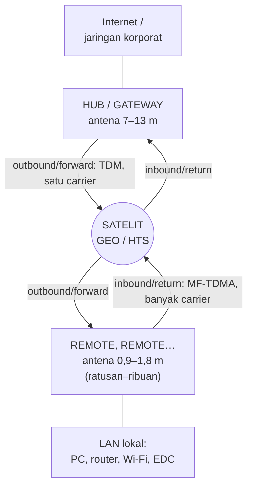

# VSAT

VSAT (*Very Small Aperture Terminal*) adalah stasiun bumi mini — antena
0,6–2,4 m — yang membawa jaringan data ke tempat yang tak terjangkau kabel dan
seluler. Di Indonesia, VSAT adalah pahlawan senyap: ATM di pulau kecil,
puskesmas di pegunungan, sekolah 3T, kapal, tambang, dan puluhan ribu titik
SATRIA-1 semuanya bicara lewat piringan kecil ini.

Halaman ini merangkai semua bab sebelumnya menjadi satu sistem nyata.

## Topologi: star mengangkasa

Arsitektur VSAT klasik adalah [topologi star](/networking/#topologi-jaringan)
dengan pusatnya di bumi dan "kabelnya" di orbit:

*Topologi star VSAT: hub memancarkan satu carrier TDM ke semua remote sekaligus
(outbound), sementara para remote berbagi kanal balik lewat MF-TDMA (inbound).*

- **Outbound (forward)**: hub memancarkan **satu carrier TDM besar** berisi
  data untuk semua remote; tiap remote memungut bagiannya.
- **Inbound (return)**: para remote berbagi kanal dengan **MF-TDMA** —
  dijatah slot waktu pada beberapa frekuensi oleh hub, sesuai permintaan.

Komunikasi antar-remote harus lewat hub → dua lompatan satelit (*double hop*,
RTT ±1 detik). Topologi **mesh** (remote-ke-remote langsung) ada untuk kasus
khusus seperti trunking telepon antar-pulau.

### MF-TDMA: berbagi transponder

Inilah [multiple access](/satelit/komunikasi#berbagi-satu-satelit-multiple-access)
dalam praktik: bandwidth transponder yang mahal dibagi dinamis. Remote yang
sedang idle nyaris tak memakai apa-apa; saat ATM mengirim transaksi, hub
memberinya slot dalam hitungan ratusan milidetik. Rasio berbagi (*contention*)
inilah yang membedakan layanan murah (1:20) dari layanan premium (1:1, CIR
terjamin).

## Anatomi terminal remote

Persis [rantai sinyal ground station](/satelit/ground-station#rantai-sinyal),
dikecilkan dan dimurahkan:

| Bagian | Nama | Fungsi |
| --- | --- | --- |
| **ODU** (outdoor) | Antena + feed | Reflektor 0,9–1,8 m ([Ku/Ka](/satelit/frekuensi-band#peta-band-satelit); C-band lebih besar) |
| | **BUC** | *Block up-converter* — up-convert + penguat kirim (2–10 W) |
| | **LNB** | Penguat terima derau rendah + down-convert ke L-band |
| **IDU** (indoor) | **Modem satelit** | Modulasi [DVB-S2/ACM](/satelit/komunikasi#modulasi-dan-coding), MF-TDMA, QoS, PEP |
| Kabel | IFL (koaksial) | Menghubungkan ODU–IDU hingga puluhan meter |

Dari sudut pandang jaringan lokal, modem VSAT hanyalah *gateway* biasa:
di belakangnya ada [switch, VLAN](/networking/switching#di-jaringan-berbasis-satelit),
router, dan LAN yang sepenuhnya normal.

## Instalasi: kenapa harus presisi

1. **Pointing** — antena diarahkan ke satelit (azimuth, elevasi, dari
   koordinat lokasi + slot orbit satelit) sampai sinyal maksimum.
2. **Polarisasi** — feed diputar tepat; salah polarisasi berarti
   [mengganggu pengguna lain](/satelit/frekuensi-band#siapa-yang-mengatur-spektrum)
   di transponder kembarannya.
3. **Cross-pol test** dengan operator (*line-up*) — wajib sebelum terminal
   diizinkan memancar penuh.
4. Komisioning: modem mengunduh konfigurasi dari hub, masuk jaringan, siap
   dipakai.

Antena melenceng 1° di GEO = melenceng ±600 km di sabuk orbit — cukup untuk
"berteriak" ke satelit tetangga. Karena itu regulasi mensyaratkan instalatur
tersertifikasi.

## PEP dan akselerasi TCP

Semua [masalah TCP di RTT 500 ms](/satelit/komunikasi#dampak-latensi-pada-tcp)
ditangani di sini:

- Modem remote dan hub menjalankan **PEP**: koneksi TCP "dipotong" di kedua
  ujung, ACK dijawab lokal, protokol khusus dipakai di segmen angkasa.
- **HTTP prefetching/caching** mempercepat web.
- QoS memprioritaskan trafik interaktif (VoIP, EDC) di atas unduhan besar —
  bandwidth satelit terlalu mahal untuk antre gaya
  [FIFO](/networking/routing#cara-router-mengambil-keputusan).

Pengalaman praktis: unduhan besar bisa kencang mendekati kapasitas, tapi
aplikasi ber-RTT-sensitif (SSH interaktif, video call) tetap terasa "jauh" —
fisika [GEO](/satelit/orbit#geo-geostationary-orbit) tak bisa di-proxy.

### Mengikuti satu transaksi ATM di pulau kecil

Seluruh modul dalam 2–3 detik kehidupan nyata:

1. Kartu digesek; mesin EDC/ATM membentuk pesan transaksi kecil (ratusan
   byte) dan membuka koneksi TCP ke server bank.
2. Paket melewati LAN → modem VSAT. PEP di modem **menjawab handshake secara
   lokal** — tanpa ini, tiga-empat kali bolak-balik GEO sudah ±2 detik sendiri.
3. Modem meminta slot [MF-TDMA](#mf-tdma-berbagi-transponder) ke hub,
   memancar 14 GHz ke satelit ±36.000 km; transponder menggeser & menguatkan;
   gateway menangkapnya.
4. Dari gateway, paket berlari lewat serat optik ke server bank — ribuan km
   dalam belasan milidetik, jauh lebih cepat dari lompatan angkasanya.
5. Balasan "transaksi disetujui" menempuh jalur sebaliknya. Total ±1,5–3
   detik — dan nasabah tidak pernah tahu uangnya baru saja ke orbit
   pulang-pergi.

Perhatikan kuncinya: transaksi kecil dan *bursty* seperti ini adalah pasangan
sempurna MF-TDMA — ribuan ATM berbagi transponder yang sama, karena
masing-masing hanya "berbicara" sepersekian detik.

## Merancang layanan: parameter yang diperjualbelikan

| Istilah | Arti | Dampak harga |
| --- | --- | --- |
| **CIR** | *Committed Information Rate* — kecepatan yang dijamin | Paling mahal |
| **MIR** | *Maximum Information Rate* — plafon saat jaringan lengang | Murah |
| Contention | Rasio berbagi kapasitas (1:1 … 1:50) | Makin besar makin murah |
| Availability | % waktu layanan hidup (99,5% khas Ku tropis) | Margin hujan = biaya |
| FAP | *Fair Access Policy* — kuota sebelum diperlambat | Layanan konsumen |

Merancang VSAT = kompromi familiar:
[band](/satelit/frekuensi-band#ringkasan-keputusan) (C tahan hujan vs Ku/Ka
murah-kapasitas), ukuran antena (kecil-murah vs margin besar), dan
CIR vs contention. Semuanya bermuara di
[link budget](/satelit/komunikasi#link-budget-akuntansi-desibel).

## VSAT vs LEO: masa depan pelosok

Starlink dkk. menawarkan RTT 20–40 ms — mengapa VSAT GEO belum mati?

| Aspek | VSAT GEO/HTS | Terminal LEO |
| --- | --- | --- |
| Latensi | ±500–600 ms | 20–40 ms |
| CIR/SLA korporat | Matang (dedicated, QoS per layanan) | Umumnya *best effort* |
| Broadcast/multicast satu wilayah | Sangat efisien | Tidak efisien |
| Kendali kedaulatan (gateway lokal, lawful intercept) | Mudah | Bergantung operator global |
| Ekosistem lokal (SATRIA-1, teleport, teknisi) | Mapan | Bertumbuh |

Jawab pendeknya: keduanya akan hidup berdampingan — LEO merebut pasar
konsumen yang haus latensi rendah; GEO/HTS bertahan di broadcast, backhaul
ber-SLA, dan program pemerintah dengan kendali penuh. Konvergensinya pun
sudah terlihat: terminal *multi-orbit* yang berpindah GEO↔LEO otomatis.

## Cek pemahaman

1. Dua kantor cabang sama-sama pakai VSAT dan saling telepon. Kenapa
   percakapannya terasa sangat tertunda dibanding menelepon kantor pusat?
2. Layanan 1:20 contention 10 Mbps vs 1:1 CIR 2 Mbps — mana untuk ATM bank,
   mana untuk Wi-Fi desa?
3. Kenapa antena VSAT melenceng 1° dianggap pelanggaran serius, bukan sekadar
   "sinyal saya jelek"?
4. Pelanggan komplain: "speedtest kencang, tapi video call patah-patah."
   Jelaskan.

Lihat jawaban

1. **Double hop**: remote→satelit→hub→satelit→remote ≈ 1 detik RTT,
   dua kali lipat jalur remote→hub.
2. ATM: **CIR 1:1** (transaksi kecil tapi wajib selalu bisa lewat — SLA).
   Wi-Fi desa: **1:20** (murah; pengguna banyak tapi toleran).
3. 1° di sabuk GEO ≈ 600 km — antenamu "berteriak" ke **satelit tetangga**
   dan mengganggu ratusan terminal orang lain.
4. Speedtest mengukur throughput (yang diselamatkan PEP+ACM); video call
   butuh **RTT rendah dan jitter kecil** — dua hal yang tidak bisa dibeli
   di GEO. Solusinya QoS ketat, atau layanan LEO/teresterial.

## Kamu sudah sampai di ujung

Dua modul selesai. Kamu kini bisa mengikuti sebuah paket dari
[handshake TCP](/networking/model-tcp-ip#tcp-andal-berurutan-kenal-kemacetan)
di laptop, melewati [switch](/networking/switching) dan
[router](/networking/routing), naik [uplink 14 GHz](/satelit/komunikasi),
memantul di [transponder](/satelit/) 36.000 km di atas ekuator, turun ke
[gateway](/satelit/ground-station), dan tiba di internet — sambil tahu persis
kenapa ia terlambat setengah detik, dan siapa yang
[mengamankannya](/networking/keamanan) di sepanjang jalan.

**Praktik:** konfigurasi router di sisi remote VSAT — QoS untuk link sempit,
DNS cache lokal, monitoring — ada di
[Wireless & Satelit (MikroTik)](/mikrotik/wireless-dan-satelit#routeros-di-jaringan-vsat).

**Lanjutan:** detail operasional — SCPC, perencanaan bandwidth, instalasi
SOP, troubleshooting, dan platform VSAT — ada di
[VSAT — Operasional & Perencanaan](/satelit/vsat-lanjut).

Selamat — dan sampai jumpa di pembaruan materi berikutnya. Kontribusi terbuka
di [GitHub](https://github.com/aderamdani/netsat).
