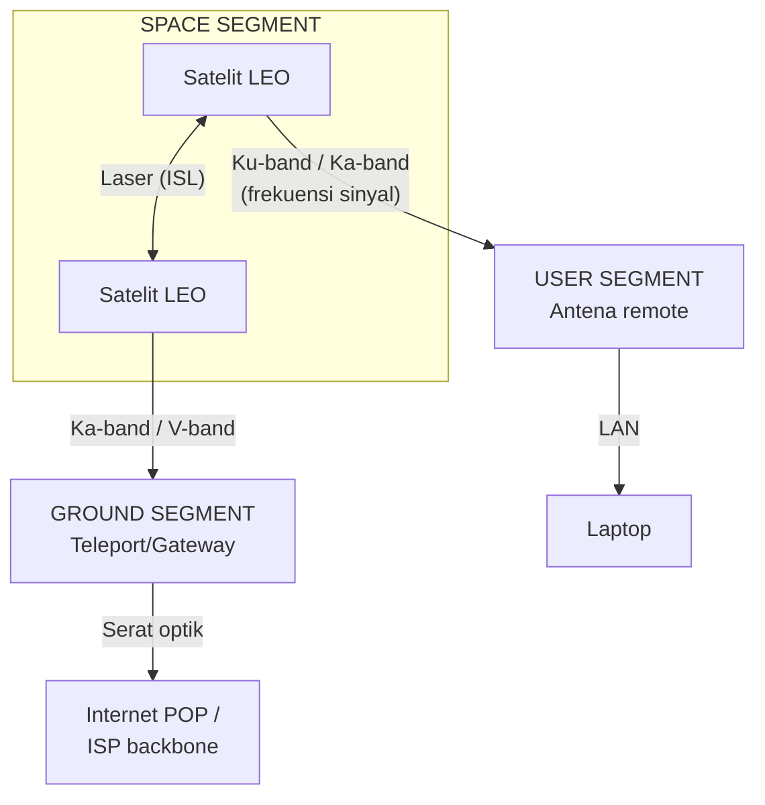

# Arsitektur Jaringan Starlink

Jaringan Starlink memadukan komunikasi nirkabel di bumi dengan konstelasi
satelit yang bergerak cepat di angkasa. Untuk mengikuti perjalanan data dari
laptop di pedalaman sampai server di belahan dunia lain, kita bedah tiga
segmen utamanya — pembagian yang sama dengan
[tiga segmen sistem satelit](/satelit/#tiga-segmen-sebuah-sistem-satelit)
di modul teori: **user segment**, **space segment**, dan **ground segment**.

## Tiga segmen utama jaringan

*Tiga segmen Starlink: satelit LEO saling terhubung lewat laser ISL, lalu
masing-masing turun ke user segment (terminal pengguna) dan ground segment
(gateway ke internet).*

### 1. User segment (terminal pengguna)

Perangkat di lokasi pelanggan:

- **User Terminal (UT)** — antena datar berteknologi **phased array** yang
  melacak satelit secara elektronik, tanpa motor pelacak — prinsipnya di
  [Melacak satelit](/satelit/ground-station#melacak-satelit).
- **Wi-Fi router** — membagikan koneksi ke LAN (kabel/nirkabel), atau
  digantikan router pihak ketiga seperti
  [MikroTik](/starlink/praktik-mikrotik).

### 2. Space segment (konstelasi satelit)

Satelit Starlink adalah router terbang:

- **Phased array antennas** — memancarkan *beam* terfokus ke ribuan terminal
  di bawahnya secara dinamis (konsep *spot beam* yang sama dengan
  [HTS](/satelit/komunikasi#beam-dari-satu-benua-ke-titik-titik-kecil)).
- **Laser inter-satellite links (ISL)** — pemancar laser antar-satelit:
  data berpindah langsung di angkasa tanpa harus turun-naik ke stasiun bumi
  di setiap lompatan.

### 3. Ground segment (stasiun bumi & gateway)

Menyambungkan angkasa ke internet fisik:

- **Gateway / teleport** — antena bumi Starlink yang menempel ke serat optik
  global; satelit menurunkan trafik ke gateway terdekat. Perannya persis
  [teleport/gateway](/satelit/ground-station#tiga-wajah-segmen-bumi) di modul
  teori.
- **Point of Presence (POP)** — titik interkoneksi dengan ISP lokal dan
  penyedia konten global (Google, Cloudflare, AWS).

## Mekanisme laser antar-satelit (Laser ISL)

Satelit komunikasi klasik bekerja sebagai *bent pipe* — cermin pantul: sinyal
terminal harus langsung dipantulkan ke gateway yang berada dalam jangkauan
pandang satelit yang **sama**. Pengguna di tengah samudra tanpa gateway dalam
radius ±1.000 km berarti tidak ada koneksi.

Starlink memecahkannya dengan meneruskan data **antar-satelit** memakai laser:

*Terminal di tengah laut memancar ke satelit terdekat, yang meneruskan
trafik lewat laser antar-satelit sampai satelit yang jangkauannya
mencapai gateway di darat.*

1. Terminal di tengah samudra memancar ke satelit terdekat (A).
2. Satelit A meneruskan lewat laser ke B, lalu C, yang sudah dekat daratan.
3. Satelit C menurunkan trafik ke gateway yang tersambung serat optik.

Hasilnya cakupan benar-benar global — laut lepas dan daerah kutub sekalipun —
dan konstelasi ini membentuk jaringan
[mesh yang benar-benar melakukan routing di angkasa](/networking/routing#routing-dan-satelit).

## Aliran perjalanan data

Perjalanan satu permintaan HTTP dari laptop lewat Starlink:

1. **Laptop → antena** — paket melewati LAN menuju *dish*.
2. **Uplink** — antena memodulasi dan memancar pada **Ku-band** (±14 GHz) ke
   satelit di ±550 km — pembagian
   [uplink/downlink](/satelit/komunikasi#uplink-dan-downlink) yang sama dengan
   satelit mana pun.
3. **Transit angkasa** — satelit meneruskan langsung ke gateway bila
   terjangkau; bila tidak, melompat antar-satelit lewat laser ISL.
4. **Downlink** — satelit menurunkan trafik ke gateway pada **Ka-band** atau
   **V-band** (kapasitas besar, [peta band](/satelit/frekuensi-band#peta-band-satelit)).
5. **Backbone** — gateway meneruskan lewat serat optik ke **POP** terdekat,
   lalu ke server tujuan.
6. **Balasan** — menempuh jalur sebaliknya. Total RTT hanya **±30–45 ms**.

## Cek pemahaman

1. Apa beda arsitektur *bent pipe* tradisional dengan arsitektur Starlink
   ber-laser ISL?
2. Frekuensi apa yang dipakai Starlink di udara, dan untuk apa?
3. Di mana titik pertemuan pertama trafik Starlink dengan internet serat
   optik komersial?

Lihat jawaban

1. Bent pipe hanya memantulkan sinyal — terminal dan gateway harus
   berada di bawah satelit yang sama. Dengan laser ISL, data diteruskan
   antar-satelit di angkasa, sehingga layanan tetap hidup di area tanpa
   gateway terdekat (tengah samudra, kutub).
2. **Ku-band** antara terminal pengguna dan satelit; **Ka-band** dan
   **V-band** untuk jalur berkapasitas besar antara satelit dan gateway bumi.
3. Di **gateway/teleport**, yang meneruskannya ke **POP** untuk
   interkoneksi dengan ISP lokal dan penyedia konten.

Berikutnya: perangkat yang dipegang pelanggan —
[Perangkat Keras](/starlink/hardware).