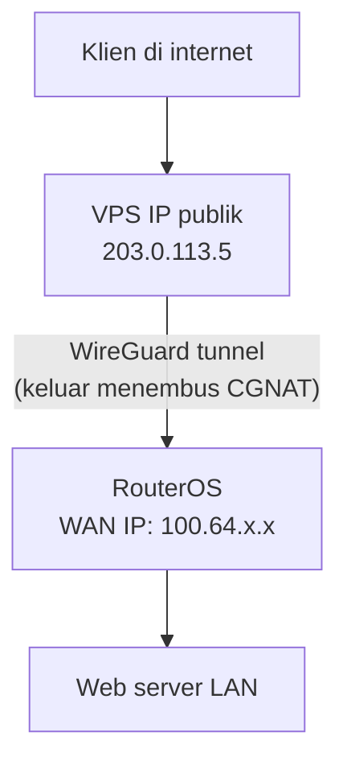

# Praktik Integrasi RouterOS

Mengganti router bawaan Starlink dengan MikroTik memberi kendali penuh atas
alamat IP, firewall, dan manajemen bandwidth di sisi LAN — semua bekal
[modul MikroTik](/mikrotik/) berlaku di sini. Halaman ini berisi konfigurasi
praktis RouterOS v7 untuk link Starlink.

## 1. Konfigurasi awal & bypass mode

Matikan dulu fungsi routing di router bawaan Starlink:

1. Buka aplikasi Starlink → **Settings** → **Bypass Starlink Router**.
2. Hubungkan kabel ethernet dari Starlink (via Ethernet Adapter di Gen 2,
   atau port langsung di Gen 3) ke **ether1** MikroTik (konvensi WAN
   [modul ini](/mikrotik/#konvensi-modul-ini)).

Lalu minta IP secara otomatis:

```routeros
/ip/dhcp-client/add interface=ether1 disabled=no use-peer-dns=yes use-peer-ntp=yes
```

Periksa `/ip/dhcp-client/print`: paket Residensial menerima IP
[CGNAT `100.64.0.0/10`](/networking/subnetting#alamat-khusus-yang-wajib-hafal);
paket Bisnis/Enterprise menerima IP publik dinamis.

## 2. Rute statis akses telemetri aplikasi Starlink

Dalam mode bypass pun, antena tetap punya IP internal **`192.168.100.1`**
yang menyajikan telemetri (latensi, obstruction, dll.) ke aplikasi Starlink.
Tambahkan rute statis agar klien LAN tetap bisa membukanya:

```routeros
/ip/route/add dst-address=192.168.100.1/32 gateway=ether1 distance=1 comment="Akses aplikasi Starlink"
```

## 3. Konfigurasi IPv6 prefix delegation

Starlink mendukung IPv6 native. Dengan **DHCPv6 Prefix Delegation (PD)**,
seisi LAN mendapat alamat global tanpa NAT (teori dasarnya di
[IPv6 di RouterOS](/mikrotik/ipv6)):

**Langkah 1 — minta prefix dari Starlink**, simpan ke pool:

```routeros
/ipv6/dhcp-client/add interface=ether1 pool-name=starlink-v6-pool request=prefix prefix-hint=::/56 disabled=no
```

**Langkah 2 — distribusikan ke LAN (SLAAC):**

```routeros
/ipv6/address/add address=::1/64 from-pool=starlink-v6-pool interface=bridge1 advertise=yes
```

Dengan `advertise=yes`, klien LAN membuat alamat global IPv6-nya sendiri
lewat SLAAC.

## 4. Workaround CGNAT (port forwarding via WireGuard)

Di paket residensial ber-CGNAT,
[dst-nat/port-forward biasa](/mikrotik/dhcp-dns-nat#dst-nat-membuka-layanan-ke-dalam-port-forward)
tidak mungkin — koneksi masuk mati di NAT milik Starlink. Solusinya membalik
arah: router **membuka koneksi keluar** ke VPS ber-IP publik, lalu trafik
masuk menumpang terowongan itu:


*Router membuka koneksi keluar ke VPS lebih dulu, sehingga trafik masuk dari
klien menumpang terowongan WireGuard yang sudah terbentuk — mengakali CGNAT
yang memblokir koneksi masuk langsung.*

Konfigurasi WireGuard di RouterOS (dasar-dasarnya di
[bab VPN](/mikrotik/vpn#wireguard-site-to-site)):

```routeros
# 1. Buat interface WireGuard
/interface/wireguard/add name=wg-cgnat-bypass listen-port=13231

# 2. Alamat IP terowongan yang dijatah VPS (mis. 10.0.0.2/24)
/ip/address/add address=10.0.0.2/24 interface=wg-cgnat-bypass

# 3. Hubungkan peer ke VPS publik
/interface/wireguard/peers/add interface=wg-cgnat-bypass \
  public-key="MASUKKAN_PUBLIC_KEY_VPS_ANDA=" \
  endpoint-address=203.0.113.5 endpoint-port=51820 \
  allowed-address=0.0.0.0/0 persistent-keepalive=25s
```

- `persistent-keepalive=25s` — denyut tiap 25 detik agar pemetaan NAT di
  jaringan Starlink tidak kedaluwarsa; tanpa ini terowongan "tertidur" dan
  koneksi dari luar gagal masuk.

## 5. Mengatasi bandwidth fluktuatif dengan QoS CAKE

Kapasitas satelit LEO berubah-ubah terus (satelit berganti, sel ramai-sepi).
Antrean statis yang kaku memicu *bufferbloat* saat sinyal melemah. Gunakan
algoritme **CAKE** di RouterOS v7 (lanjutan
[QoS Dinamis](/mikrotik/dynamic-qos)):

```routeros
# 1. Buat tipe antrean CAKE untuk upload (TX) dan download (RX)
/queue type
add name=starlink-cake-tx kind=cake cake-flowmode=triple-isolate cake-nat=yes
add name=starlink-cake-rx kind=cake cake-flowmode=triple-isolate cake-nat=yes

# 2. Pasang simple queue memakai tipe antrean CAKE
/queue simple
add name=starlink-cake-qos target=192.168.88.0/24 \
  queue=starlink-cake-tx/starlink-cake-rx comment="QoS dinamis Starlink (CAKE)"
```

- `cake-flowmode=triple-isolate` — membagi bandwidth secara adil per host
  pengirim, penerima, dan aliran; satu klien yang mengunduh besar-besaran
  tidak bisa memonopoli link.

## Cek pemahaman

1. Mengapa `persistent-keepalive=25s` penting pada WireGuard penembus CGNAT?
2. Apa keunggulan QoS CAKE dibanding simple queue statis (`max-limit` kaku)
   di link satelit LEO?
3. Setelah bypass mode aktif, apakah manajemen bandwidth dan firewall tetap
   bisa dilakukan di RouterOS?

<details>
<summary>Lihat jawaban</summary>

1. NAT Starlink menghapus pemetaan sesi yang lama diam. Paket kecil
   tiap 25 detik menjaga pemetaan tetap hidup sehingga terowongan bisa terus
   dimasuki dari arah luar.
2. CAKE membagi bandwidth secara dinamis dan adil (*fair queueing*)
   tanpa batas kaku — pas untuk Starlink yang kapasitasnya naik-turun;
   antrean statis justru memicu bufferbloat saat kapasitas turun.
3. Ya — justru penuh: RouterOS memegang IP WAN langsung, sehingga
   firewall, NAT, routing, dan QoS untuk seluruh LAN 100% di tanganmu.

</details>

Terakhir: saat koneksi bermasalah —
[Troubleshooting & Diagnostik](/starlink/troubleshooting).